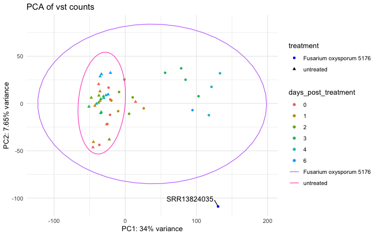
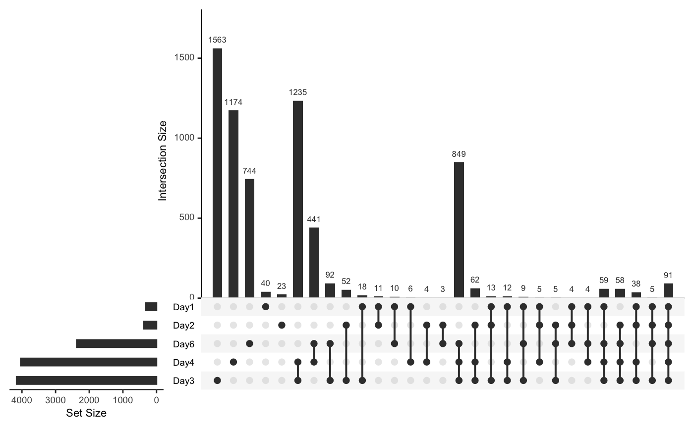
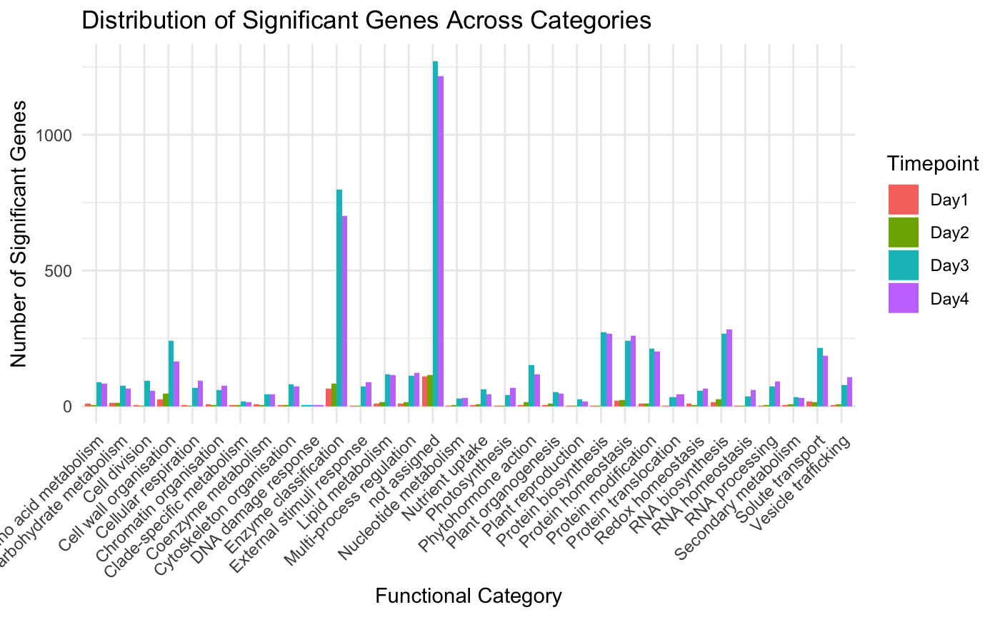

# Bachelor thesis Luisa

## Goals for PA
### Preprocessing

1. Read in and extract the SRA samples with **sratoolkit**

Bash-Script: preprocessing.sh

Dataset from Paper: A primary cell wall cellulose-dependent defense mechanism against vascular pathogens revealed by time-resolved dual transcriptomics.  
https://bmcbiol.biomedcentral.com/articles/10.1186/s12915-021-01100-6#Sec13  
GEO repository: GSE168919, Accession via PRJNA714597 
mRNA-profiles of Arabidopsis thaliana both untreated and infected with pathogen Fusarium oxysporum.  
Downloaded 17 Samples from Day 0 and Day 6 post treatment (untreated and infected) to compare between later.

2. **FASTQC**

Used the package fastqc from conda and stored the results in folder fastqc_results.

3. **Adapter trimming** with trimmomatic and cutadapt

Performed trimmomatic on the .fastq files for basic adapter trimming. Then run cutadapt on the results to eliminate the polyA adapters. 

4. **FASTQC** again and **MultiQC report**

FastQC showed good results on adapter content.
MultiQC report on trimmed reads.

5. **Alignment** to an Arabidopsis thaliana genome (TAIR10) with **Kallisto**

allignment_kallisto.sh

Downloaded Kallisto via conda. 
Downloaded whole Arabidopsis thaliana transcriptome in TAIR: TAIR10.cdna.all.fa  
Built Kallisto index and run kallisto quantification algorithm in SLURM.  
Output: abundance.tsv file for each of the 17 samples.  
Done MultiQC with Kallisto alignment results.

Repeating the preprocessing step with the rest of the samples, altogether 50 samples.
Build raw and tpm count matrix to load into R. (build_count_matrix.py)

### Differential gene expression analysis in R

DownstreamAnalysis.Rmd

- Loaded count matrices SRA runtable (for metainfo) in R.
- Dropped Samples with very low alignment rate (1.2%-1.6%). 
- Filtered low expressed genes, where the tpm is at least 0.5 for 51% of the genes. 
- Used variance stabilization transformation on the DESeqDataset and created a heatmap of sample-to-sample distances and PCA to search for potential outliers. 

 

- DESeq with Interaction term: design: ~treatment + days_post_treatment + treatment:days_post_treatment. 
- Explored the DESeq results and saved the interaction results for time effect in untreated vs treated and the significant genes in each dataset. 
- Created a venn diagram and upset to look for overlaps in significant genes from each day. 

 

- Loaded Mercator results for Gene level annotations and merged them with the DESeq results. 
- Counted significant genes in each functional category to visualize the counts for each timepoint.  

 

- Created a table with the top 30 significant genes for each timepoint and their functional categories.  

GENE_ID	CATEGORY	FUNCTION	P_VALUE	LOG_FOLD_CHANGE	days_post_treatment
AT3G29970.3	not assigned	not assigned.not annotated	0.0000000	-30.000000	1
AT3G23090.5	Cytoskeleton organisation	Cytoskeleton organisation.microtubular network.microtubule dynamics.microtubule-stabilizing factor *(WDL1/2/++)	0.0000000	24.770580	1
AT5G39580.1	Enzyme classification	Enzyme classification.EC_1 oxidoreductases.EC_1-11 oxidoreductase acting on peroxide as acceptor	0.0000000	-21.797275	1
AT1G77120.1	Carbohydrate metabolism	Carbohydrate metabolism.fermentation.acetic acid biosynthesis.alcohol dehydrogenase *(ADH)	0.0000002	-10.723679	1
AT4G33070.1	Enzyme classification	Enzyme classification.EC_4 lyases.EC_4-1 carbon-carbon lyase	0.0000003	-12.639964	1
AT4G33070.1	Carbohydrate metabolism	Carbohydrate metabolism.fermentation.acetic acid biosynthesis.pyruvate decarboxylase *(PDC)	0.0000003	-12.639964	1
AT4G30200.4	Chromatin organisation	Chromatin organisation.post-translational histone modification.histone methylation.lysine methylation.class-I histone methyltransferase activities.PRC2 histone methylation complex.associated protein factors.PRC2-VRN-interacting factor *(VIN3/VEL)	0.0000004	-22.681349	1
AT3G57010.1	Enzyme classification	Enzyme classification.EC_4 lyases.EC_4-3 carbon-nitrogen lyase	0.0000004	2.717517	1
AT1G23490.1	Vesicle trafficking	Vesicle trafficking.retrograde trafficking.Coat protein I (COPI) coatomer machinery.coat protein recruiting.ARF-GTPase activities.ARF-GTPase *(ARF1)	0.0000009	1.611033	1
AT5G46890.1	not assigned	not assigned.annotated	0.0000041	4.851000	1
AT2G23120.1	not assigned	not assigned.not annotated	0.0000048	2.539142	1
AT5G15970.1	not assigned	not assigned.annotated	0.0000303	4.667361	1
AT3G13650.1	not assigned	not assigned.annotated	0.0000463	4.233481	1
AT5G12020.1	Protein homeostasis	Protein homeostasis.protein quality control.smallHsp holdase chaperone activities.class-C-II protein	0.0000782	-13.333019	1
AT2G16060.1	Multi-process regulation	Multi-process regulation.nitric oxide signalling.homeostasis.class-1/2 phytoglobin *(PGB1/2)	0.0001320	-7.230963	1
AT3G21720.1	Lipid metabolism	Lipid metabolism.fatty acid metabolism.fatty acid degradation.glyoxylate cycle.isocitrate lyase	0.0001478	-5.478022	1
AT3G21720.1	Enzyme classification	Enzyme classification.EC_4 lyases.EC_4-1 carbon-carbon lyase	0.0001478	-5.478022	1
AT5G66390.1	Enzyme classification	Enzyme classification.EC_1 oxidoreductases.EC_1-11 oxidoreductase acting on peroxide as acceptor	0.0001849	1.844837	1
AT5G66390.1	Cell wall organisation	Cell wall organisation.lignin.monolignol conjugation and polymerization.class-III lignin peroxidase	0.0001849	1.844837	1
AT4G24110.1	not assigned	not assigned.not annotated	0.0001985	-7.454890	1
AT5G10710.1	Cell division	Cell division.cell cycle organisation.chromosome segregation.constitutive centromere-associated network.centromere protein *(CENP-O)	0.0002550	19.232793	1
AT1G55020.1	Redox homeostasis	Redox homeostasis.reactive electrophilic lipid homeostasis.oxylipin generation.9-lipoxygenase *(LOX1/5)	0.0002550	-5.889131	1
AT1G55020.1	Enzyme classification	Enzyme classification.EC_1 oxidoreductases.EC_1-13 oxidoreductase acting on single donor with incorporation of molecular oxygen (oxygenase)	0.0002550	-5.889131	1
AT2G03090.1	Cell wall organisation	Cell wall organisation.cell wall proteins.expansin activities.alpha-class expansin	0.0002787	3.827858	1
AT3G44320.1	Clade-specific metabolism	Clade-specific metabolism.Brassicaceae.glucosinolate degradation.nitrilase *(NIT)	0.0002787	1.571208	1
AT3G44320.1	Enzyme classification	Enzyme classification.EC_3 hydrolases.EC_3-5 hydrolase acting on carbon-nitrogen bond, other than peptide bond	0.0002787	1.571208	1
AT2G46220.1	not assigned	not assigned.not annotated	0.0002787	-1.565266	1
AT1G17520.4	not assigned	not assigned.annotated	0.0003377	7.731785	1
AT5G42500.1	not assigned	not assigned.annotated	0.0003377	2.739193	1
AT1G43800.1	Lipid metabolism	Lipid metabolism.fatty acid metabolism.fatty acid desaturation.first desaturation.delta-9 stearoyl-ACP desaturase *(AAD)	0.0004244	-12.665598	1

Next up: Pathway level enrichment