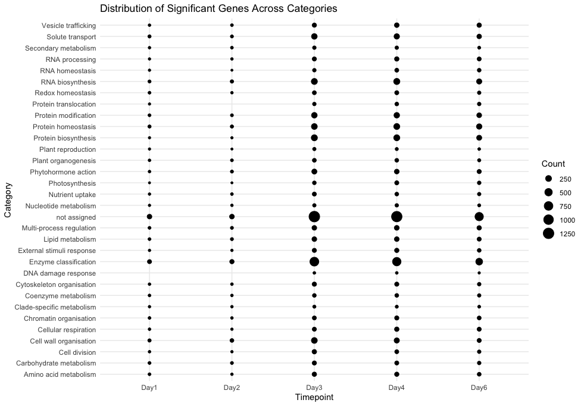
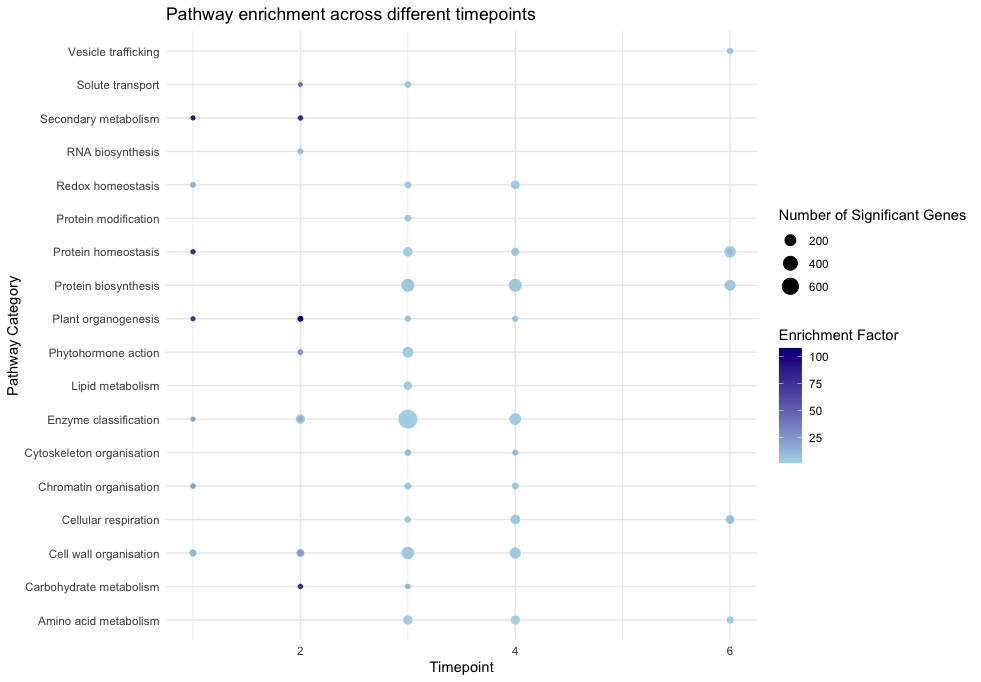
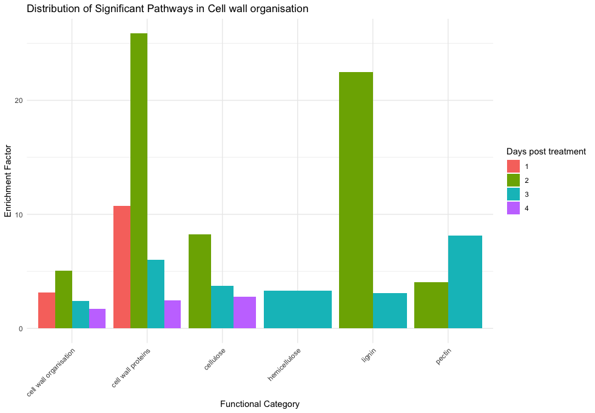

# Bachelor thesis Luisa

## Goals for PA
### Preprocessing

1. Read in and extract the SRA samples with **sratoolkit**

Bash-Script: preprocessing.sh

Dataset from Paper: A primary cell wall cellulose-dependent defense mechanism against vascular pathogens revealed by time-resolved dual transcriptomics.  
https://bmcbiol.biomedcentral.com/articles/10.1186/s12915-021-01100-6#Sec13  
GEO repository: GSE168919, Accession via PRJNA714597 
mRNA-profiles of Arabidopsis thaliana both untreated and infected with pathogen Fusarium oxysporum.  
Downloaded 17 Samples from Day 0 and Day 6 post treatment (untreated and infected) to compare between later.

2. **FASTQC**

Used the package fastqc from conda and stored the results in folder fastqc_results.

3. **Adapter trimming** with trimmomatic and cutadapt

Performed trimmomatic on the .fastq files for basic adapter trimming. Then run cutadapt on the results to eliminate the polyA adapters. 

4. **FASTQC** again and **MultiQC report**

FastQC showed good results on adapter content.
MultiQC report on trimmed reads.

5. **Alignment** to an Arabidopsis thaliana genome (TAIR10) with **Kallisto**

allignment_kallisto.sh

Downloaded Kallisto via conda. 
Downloaded whole Arabidopsis thaliana transcriptome in TAIR: TAIR10.cdna.all.fa  
Built Kallisto index and run kallisto quantification algorithm in SLURM.  
Output: abundance.tsv file for each of the 17 samples.  
Done MultiQC with Kallisto alignment results.

Repeating the preprocessing step with the rest of the samples, altogether 50 samples.
Build raw and tpm count matrix to load into R. (build_count_matrix.py)

### Differential gene expression analysis in R

DownstreamAnalysis.Rmd

- Loaded count matrices SRA runtable (for metainfo) in R.
- Dropped Samples with very low alignment rate (1.2%-1.6%). 
- Filtered low expressed genes, where the tpm is at least 0.5 for 51% of the genes. 
- Used variance stabilization transformation on the DESeqDataset and created a heatmap of sample-to-sample distances and PCA to search for potential outliers. 

 

**DESeq2**

- DESeq with Interaction term: design: ~treatment + days_post_treatment + treatment:days_post_treatment. 
- Explored the DESeq results and saved the interaction results for time effect in untreated vs treated and the significant genes in each dataset. 
- Created a venn diagram and upset to look for overlaps in significant genes from each day. 

 

**Mercator**

- Mercator protein annotation with A. thaliana transcript file from TAIR
- Loaded Mercator results (mapping file and fasta file) for Gene level annotations and merged them with the DESeq results. 
- Counted significant genes in each functional category to visualize the counts for each timepoint.  

- Created a table with the top 30 significant genes for each timepoint and their functional categories. 

GENE_ID     |CATEGORY    |FUNCTION|  P_VALUE|  	LOG_FOLD_CHANGE|	days_post_treatment
:----------:|:----------:|:------:|:-------:|:----------------:|:-----------------------:
AT1G16030.1	|Protein homeostasis|	Protein homeostasis.protein quality control.cytosolic Hsp70 chaperone system.Hsp70 chaperone activities.molecular chaperone *(Hsp70-1/2/3/4/5)|	0|	-11.119594	|3
AT2G22170.1|	Lipid metabolism|	Lipid metabolism.lipid trafficking.endoplasmic reticulum-plasma membrane lipid transfer.lipid trafficking protein *(PLAT)|	0	|5.416741|	3
 

- find here all different expressed annotated genes for each timepoint:
[annotated genes](files/)

**MapMan (Mercator4 BIN enrichment analysis)**

- pathway enrichment analysis with Mercator result mapping file
- genes of interest: significant genes for each timepoint, background genes: all genes from annotated fasta file
- result: significant pathways with genes in MapMan category for each timepoint

- focusing on cell wall organisation

