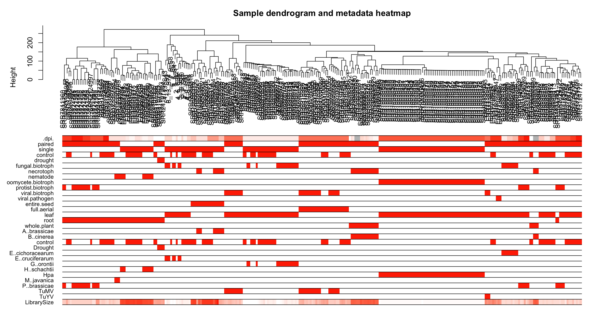

# Bachelor's thesis in Bioinformatics
##### Author: Luisa Bender

This Github repository contains the code, plots and files for the bachelor's thesis on Weighted Gene Co-Expression Network Analysis (WGCNA).

Topic:

**Unveiling Commonalities and Divergences in Biotrophic Plant-Microbe Interactions using Gene Co-Expression Networks in Arabidopsis thaliana.**

## Objectives of the thesis
This thesis focuses on the comparative analysis across various infection experiments involving different biotrophic plant-microbe interactions, with the aim of identifying genes or pathways that are co-expressed during these infections. In order to achieve that, we would use publicly available datasets from the Sequence Read Archive (SRA), hosted by the National Center for Biotechnology Information ([NCBI](https://www.ncbi.nlm.nih.gov/sra)). The data will have to go through several preprocessing steps, such as quality control, adapter trimming, sequence alignment, and data transformation, in order to prepare it for the weighted gene co-expression network analysis (WGCNA). This analysis would reveal the underlying correlation and similarities among the genes. 
To reach our objective, we would then use pathway-level enrichments for functional insights into the genes involved, which might help in understanding how plants respond to different microbes and their infection strategies at a systems level. 

[Workflow](workflow.pdf)
[Final presentation](Final_presentation.pdf)

### Supplementary
Following supplementary files and figures are referenced in the thesis.

Table S1: [RNA-Seq data on Arabidopsis thaliana](data/arabidopsis_datasets_info.xlsx) - This file contains information about the datasets used for the study, such as BioProjectID, associated publication and further information. 

Table S2: [Metadata](data/metaData_modified.csv) - This table contains metadata of each sample.

Figure S3: [MultiQC-Report](quality_control/multiqc_after_trim.html) - MultiQC HTML Report of all samples after quality trimming.

Figure S4:  Sample dendrogram with metadata - This plot shows a dendrogram of all samples after removing outliers. On each branch, the sample ID is displayed. The height on the y-axis describes the distance between each sample. Below the dendrogram, all available metadata of the samples are defined. Red coloring means that the samples on the dendrogram branches belong to the metadata category.

All Gene Ontology (GO) enrichment figures for specific modules are stored here: [GO plots](plots/WGCNA/Gene%20Ontology/)

#### Count tables
This folder contains all raw gene, abundance and vst transformed count tables.

[Raw gene counts](count_tables/counts_genelev_corrected.csv)

[Abundance (TPM) counts](count_tables/counts_tpm_abundance2.csv)

[VST transformed gene counts](count_tables/expr_data.csv)

[Transposed count table as input for WGCNA](count_tables/expr_data_transposed.csv)

#### Scripts
- [Preprocessing](scripts/preprocessing.sh)
- Kallisto: [index](scripts/index_kallisto.sh), [single alignment](scripts/kallisto_single_parallel.sh), [paired alignment](scripts/kallisto_paired_parallel.sh)
- [Import gene counts](scripts/tximport.R)
- [PCA, VST and sample clustering](scripts/WGCNA_data_cleaning.Rmd)
- [WGCNA](scripts/WGCNA.Rmd), [Markdown](scripts/WGCNA.md)

### Internship (Praktische Arbeit)
Code and files, as well as a README of the internship are found here: [praktische-arbeit](praktische-arbeit/).
