Weighted Gene Co-Expression Network Analysis
================
2025-01-13

``` r
# load packages
library(WGCNA)
```

    ## Loading required package: dynamicTreeCut

    ## Loading required package: fastcluster

    ## 
    ## Attaching package: 'fastcluster'

    ## The following object is masked from 'package:stats':
    ## 
    ##     hclust

    ## 

    ## 
    ## Attaching package: 'WGCNA'

    ## The following object is masked from 'package:stats':
    ## 
    ##     cor

``` r
library(dplyr)
```

    ## 
    ## Attaching package: 'dplyr'

    ## The following objects are masked from 'package:stats':
    ## 
    ##     filter, lag

    ## The following objects are masked from 'package:base':
    ## 
    ##     intersect, setdiff, setequal, union

``` r
library(ggplot2)
library(tidyr)
library(clusterProfiler)
```

    ## clusterProfiler v4.14.4 Learn more at https://yulab-smu.top/contribution-knowledge-mining/
    ## 
    ## Please cite:
    ## 
    ## S Xu, E Hu, Y Cai, Z Xie, X Luo, L Zhan, W Tang, Q Wang, B Liu, R Wang,
    ## W Xie, T Wu, L Xie, G Yu. Using clusterProfiler to characterize
    ## multiomics data. Nature Protocols. 2024, 19(11):3292-3320

    ## 
    ## Attaching package: 'clusterProfiler'

    ## The following object is masked from 'package:stats':
    ## 
    ##     filter

``` r
library(org.At.tair.db)
```

    ## Loading required package: AnnotationDbi

    ## Loading required package: stats4

    ## Loading required package: BiocGenerics

    ## 
    ## Attaching package: 'BiocGenerics'

    ## The following objects are masked from 'package:dplyr':
    ## 
    ##     combine, intersect, setdiff, union

    ## The following objects are masked from 'package:stats':
    ## 
    ##     IQR, mad, sd, var, xtabs

    ## The following objects are masked from 'package:base':
    ## 
    ##     anyDuplicated, aperm, append, as.data.frame, basename, cbind,
    ##     colnames, dirname, do.call, duplicated, eval, evalq, Filter, Find,
    ##     get, grep, grepl, intersect, is.unsorted, lapply, Map, mapply,
    ##     match, mget, order, paste, pmax, pmax.int, pmin, pmin.int,
    ##     Position, rank, rbind, Reduce, rownames, sapply, saveRDS, setdiff,
    ##     table, tapply, union, unique, unsplit, which.max, which.min

    ## Loading required package: Biobase

    ## Welcome to Bioconductor
    ## 
    ##     Vignettes contain introductory material; view with
    ##     'browseVignettes()'. To cite Bioconductor, see
    ##     'citation("Biobase")', and for packages 'citation("pkgname")'.

    ## Loading required package: IRanges

    ## Loading required package: S4Vectors

    ## 
    ## Attaching package: 'S4Vectors'

    ## The following object is masked from 'package:clusterProfiler':
    ## 
    ##     rename

    ## The following object is masked from 'package:tidyr':
    ## 
    ##     expand

    ## The following objects are masked from 'package:dplyr':
    ## 
    ##     first, rename

    ## The following object is masked from 'package:utils':
    ## 
    ##     findMatches

    ## The following objects are masked from 'package:base':
    ## 
    ##     expand.grid, I, unname

    ## 
    ## Attaching package: 'IRanges'

    ## The following object is masked from 'package:clusterProfiler':
    ## 
    ##     slice

    ## The following objects are masked from 'package:dplyr':
    ## 
    ##     collapse, desc, slice

    ## 
    ## Attaching package: 'AnnotationDbi'

    ## The following object is masked from 'package:clusterProfiler':
    ## 
    ##     select

    ## The following object is masked from 'package:dplyr':
    ## 
    ##     select

    ## 

``` r
library(caret)
```

    ## Loading required package: lattice

    ## 
    ## Attaching package: 'lattice'

    ## The following object is masked from 'package:clusterProfiler':
    ## 
    ##     dotplot

``` r
library(tibble)
```

### Data cleaning

1.  Load normalized expression Data and transform so that rows = samples
    and cols = genes
2.  Identify outlier genes with WGCNA package -\> goodSamplesGenes
3.  Identify outlier samples with hierarchical clustering

``` r
# load expression data
options(stringsAsFactors = FALSE)
#expr_data <- read.csv("~/Studium/bachelor-thesis-luisa/count_tables/vst_expression_data.csv", row.names = 1)

# transposed expression data for WGCNA
input_mat <- read.csv("~/Studium/bachelor-thesis-luisa/count_tables/expr_data_transposed.csv", row.names = 1)

# load meta data
metaData <- read.csv("~/Studium/bachelor-thesis-luisa/data/metaData_modified.csv")
metaData_bin <- read.csv("~/Studium/bachelor-thesis-luisa/data/metaData_bin.csv", sep =";")
```

``` r
gsg = goodSamplesGenes(input_mat, verbose = 3)
```

    ##  Flagging genes and samples with too many missing values...
    ##   ..step 1

``` r
gsg$allOK # TRUE
```

    ## [1] TRUE

``` r
summary(gsg)
```

    ##             Length Class  Mode   
    ## goodGenes   25175  -none- logical
    ## goodSamples   279  -none- logical
    ## allOK           1  -none- logical

``` r
sampleTree <- hclust(dist(input_mat), method = "average") # average linkage method

par(cex = 0.6);
par(mar = c(0,4,2,0))

plot(sampleTree, main = "Sample clustering to detect outliers", sub="", xlab="", cex.lab = 1.5,
cex.axis = 1.5, cex.main = 2)
```

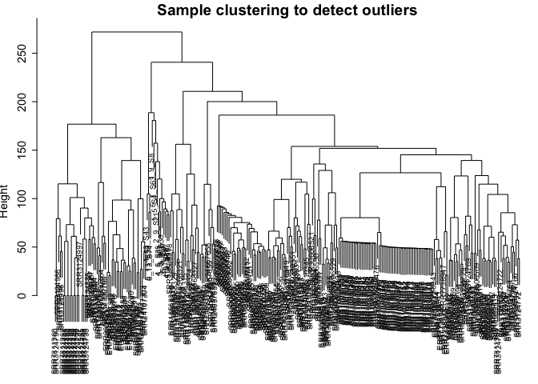<!-- -->

### Network construction

``` r
allowWGCNAThreads()
```

    ## Allowing multi-threading with up to 8 threads.

``` r
# set of soft-thresholding powers
powers = c(c(1:10), seq(from = 12, to = 20, by = 2))
sft <- pickSoftThreshold(input_mat, powerVector = powers, verbose = 5, networkType = "signed hybrid")
```

    ## pickSoftThreshold: will use block size 1777.
    ##  pickSoftThreshold: calculating connectivity for given powers...
    ##    ..working on genes 1 through 1777 of 25175
    ##    ..working on genes 1778 through 3554 of 25175
    ##    ..working on genes 3555 through 5331 of 25175
    ##    ..working on genes 5332 through 7108 of 25175
    ##    ..working on genes 7109 through 8885 of 25175
    ##    ..working on genes 8886 through 10662 of 25175
    ##    ..working on genes 10663 through 12439 of 25175
    ##    ..working on genes 12440 through 14216 of 25175
    ##    ..working on genes 14217 through 15993 of 25175
    ##    ..working on genes 15994 through 17770 of 25175
    ##    ..working on genes 17771 through 19547 of 25175
    ##    ..working on genes 19548 through 21324 of 25175
    ##    ..working on genes 21325 through 23101 of 25175
    ##    ..working on genes 23102 through 24878 of 25175
    ##    ..working on genes 24879 through 25175 of 25175
    ##    Power SFT.R.sq  slope truncated.R.sq mean.k. median.k. max.k.
    ## 1      1    0.111  0.448          0.818 3730.00  3320.000   7490
    ## 2      2    0.367 -0.708          0.877 1490.00  1270.000   4250
    ## 3      3    0.708 -1.210          0.930  737.00   560.000   2780
    ## 4      4    0.825 -1.390          0.959  415.00   281.000   1950
    ## 5      5    0.860 -1.470          0.959  256.00   153.000   1450
    ## 6      6    0.891 -1.490          0.964  169.00    87.500   1130
    ## 7      7    0.914 -1.470          0.964  117.00    52.700    898
    ## 8      8    0.917 -1.450          0.955   85.00    32.500    735
    ## 9      9    0.912 -1.440          0.941   63.70    20.700    621
    ## 10    10    0.906 -1.430          0.928   49.00    13.500    532
    ## 11    12    0.936 -1.360          0.945   31.10     6.030    403
    ## 12    14    0.938 -1.340          0.951   21.10     2.830    327
    ## 13    16    0.925 -1.340          0.950   15.10     1.390    279
    ## 14    18    0.918 -1.340          0.955   11.20     0.714    241
    ## 15    20    0.903 -1.340          0.949    8.62     0.379    210

``` r
sizeGrWindow(9,5)
par(mfrow = c(1,2));
cex1 = 0.9;
plot(sft$fitIndices[, 1],
     -sign(sft$fitIndices[, 3]) * sft$fitIndices[, 2],
     xlab = "Soft Threshold (power)",
     ylab = "Scale Free Topology Model Fit, signed R^2", type = "n",
     main = paste("Scale independence")
)
text(sft$fitIndices[, 1],
     -sign(sft$fitIndices[, 3]) * sft$fitIndices[, 2],
     labels = powers, cex = cex1, col = "red");

abline(h = 0.85, col = "red")
plot(sft$fitIndices[, 1],
     sft$fitIndices[, 5],
     xlab = "Soft Threshold (power)",
     ylab = "Mean Connectivity",
     type = "n",
     main = paste("Mean connectivity")
)
text(sft$fitIndices[, 1],
     sft$fitIndices[, 5],
     labels = powers,
     cex = cex1, col = "red")
```

Due to memory issues, run WGCNA_netconstr.R (step-by-step) or
WGCNA_auto_netconstr.R (automatic) on the cluster for network
construction and module detection.

Results for different soft powers:

``` r
# network construction with soft power 6 - signed hybrid network
load('~/Studium/bachelor-thesis-luisa/wgcna_results/new/networkConstruction-pow6_signed.RData')
moduleColors_pow6_signed <- mergedColors
MEs_pow6_signed <- mergedMEs
geneTree_pow6_signed <- geneTree

# network construction with soft power 5 - signed hybrid network
load('~/Studium/bachelor-thesis-luisa/wgcna_results/new/networkConstruction-pow5_signed.RData')
moduleColors_pow5_signed <- mergedColors
MEs_pow5_signed <- mergedMEs
geneTree_pow5_signed <- geneTree

# network construction with soft power 4 - signed hybrid network
load('~/Studium/bachelor-thesis-luisa/wgcna_results/new/networkConstruction-pow4_signed.RData')
moduleColors_pow4_signed <- mergedColors
MEs_pow4_signed <- mergedMEs
geneTree_pow4_signed <- geneTree

# network construction with soft power 4 - signed hybrid network with TOMType signed
load('~/Studium/bachelor-thesis-luisa/wgcna_results/new/networkConstruction-pow4_TOMsigned.RData')
moduleColors_pow4_tomsigned <- mergedColors
MEs_pow4_tomsigned <- mergedMEs
geneTree_pow4_tomsigned <- geneTree
```

``` r
# plots the gene dendrogram with the module colors
plotDendroAndColors(geneTree_pow4_signed, 
                    moduleColors_pow4_signed,
                    "Module",
                    dendroLabels = FALSE, 
                    hang = 0.03,
                    addGuide = TRUE, 
                    guideHang = 0.05,
                    main = "Gene dendrogram and module colors")
```

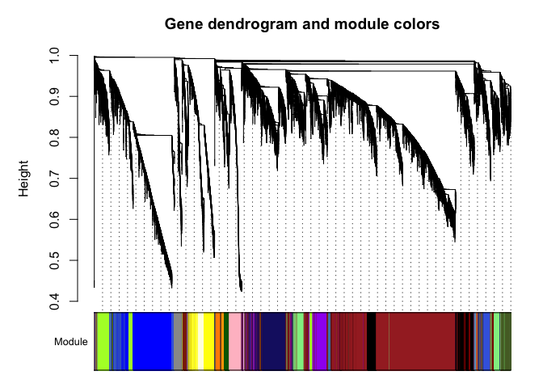<!-- -->

``` r
table(moduleColors_pow4_signed)
```

    ## moduleColors_pow4_signed
    ##          black           blue          brown      darkgreen    darkmagenta 
    ##           1779           3108           7847            352            108 
    ## darkolivegreen     darkorange        darkred    greenyellow         grey60 
    ##            730            208            570           1375            452 
    ##     lightgreen    lightyellow  mediumpurple3   midnightblue         orange 
    ##           1184            425             52           2010            209 
    ##     orangered4           pink          plum1         purple      royalblue 
    ##            236            729             84           1115            909 
    ##    saddlebrown        sienna3       skyblue3      steelblue         yellow 
    ##            190            105             88            188           1122

### External Trait Matching

``` r
nGenes = ncol(input_mat);
nSamples = nrow(input_mat);
picked_module_colors = moduleColors_pow4_signed

MEs0 = moduleEigengenes(input_mat, picked_module_colors)$eigengenes
MEs = orderMEs(MEs0)
```

Discover Module trait relationships:

``` r
# divide meta table into subsets

# infected pathogens
inf_path_df <- metaData_bin[, grep("inf_path", colnames(metaData_bin))]
colnames(inf_path_df) <- gsub("inf_path.", "", colnames(inf_path_df))

# pathogen categories
cat_df <- metaData_bin[, grep("Category_trophs", colnames(metaData_bin))]
colnames(cat_df) <- gsub("Category_trophs.", "", colnames(cat_df))
cat_df <- cat_df[,-1]

# pathogen subcategories
sub_cat_df <- metaData_bin[, grep("Category\\.", colnames(metaData_bin))]
colnames(sub_cat_df) <- gsub("Category\\.", "", colnames(sub_cat_df))

# librarySize
libsize_df <- data.frame(LibrarySize = metaData[, 17])

#latest_df <- metaData_bin[, grep("latest_infection_timepoint.", colnames(metaData_bin))]
#colnames(latest_df) <- gsub("latest_infection_timepoint.", "", colnames(latest_df))
#latest_df <- latest_df[,-1]
```

``` r
moduleTraitCorrelation <- function(MEs, metaData, trait){
  moduleTraitCor = cor(MEs, metaData, use = "p"); # pearson correlation
  moduleTraitPvalue = corPvalueStudent(moduleTraitCor, nSamples);
  
  sizeGrWindow(10,6)
  textMatrix = paste(signif(moduleTraitCor, 2), "\n(",
                     signif(moduleTraitPvalue, 1), ")", sep = "")
  
  dim(textMatrix) = dim(moduleTraitCor)
  par(mar = c(6, 13, 3, 2.2))
  
  labeledHeatmap(Matrix = moduleTraitCor,
                 xLabels = colnames(metaData),
                 yLabels = names(MEs),
                 xLabelsAngle = 30,
                 ySymbols = names(MEs),
                 colorLabels = TRUE,
                 colors = blueWhiteRed(50),
                 textMatrix = textMatrix,
                 setStdMargins = FALSE,
                 cex.text = 0.5,
                 cex.lab.x = 1,
                 cex.lab.y = 1,
                 zlim = c(-1,1),
                 legendLabel = "Pearson's correlation",
                 main = paste("Module-trait relationships -", trait))
}

moduleTraitCorrelation(MEs, inf_path_df[,-11], "Pathogens")
moduleTraitCorrelation(MEs, sub_cat_df, "Pathogens (subcategories)")
moduleTraitCorrelation(MEs, cat_df, "Pathogens (categories)")
moduleTraitCorrelation(MEs, libsize_df, "Library Size")
#moduleTraitCorrelation(MEs, latest_df, "Comparing latest infection timepoints")
```

Look for weak correlations and sum up the absolute correlation value:

``` r
biotrophs <- c("E..cichoracearum", "E..cruciferarum", "G..orontii", "H..schachtii", "Hpa", "M..javanica", "P..brassicae", "TuMV", "TuYV")

module_trait_inf_path <- cor(MEs, inf_path_df, use = "p")

biotrophic_modules <- rowSums(abs(module_trait_inf_path[, biotrophs]))
ranked_modules <- sort(biotrophic_modules, decreasing = TRUE)
head(ranked_modules)
```

    ## MEsteelblue    MEpurple     MEbrown   MEdarkred MEroyalblue  MEskyblue3 
    ##    1.733268    1.673186    1.642750    1.640792    1.606671    1.604495

### Target Gene Identification

``` r
modNames = substring(names(MEs), 3) #extract module names

# calculate the module membership and the associated p-values for every gene and module
geneModuleMembership = as.data.frame(cor(input_mat, MEs, use = "p"))
MMPvalue = as.data.frame(corPvalueStudent(as.matrix(geneModuleMembership), nSamples)) 
names(geneModuleMembership) = paste("MM", modNames, sep="")
names(MMPvalue) = paste("p.MM", modNames, sep="")
```

``` r
geneTraitSignificance_inf_path = as.data.frame(cor(input_mat,inf_path_df, use = "p"))
GSPvalue = as.data.frame(corPvalueStudent(as.matrix(geneTraitSignificance_inf_path), nSamples))

geneTraitSignificance_cat = as.data.frame(cor(input_mat,cat_df, use = "p"))
GSPvalue = as.data.frame(corPvalueStudent(as.matrix(geneTraitSignificance_cat), nSamples))

geneTraitSignificance_sub_cat = as.data.frame(cor(input_mat,sub_cat_df, use = "p"))
GSPvalue = as.data.frame(corPvalueStudent(as.matrix(geneTraitSignificance_sub_cat), nSamples))

geneTraitSignificance_inf_path$Module <- picked_module_colors
geneTraitSignificance_cat$Module <- picked_module_colors
geneTraitSignificance_sub_cat$Module <- picked_module_colors
```

``` r
meanGS_per_module_inf_path <- aggregate(. ~ Module, data = geneTraitSignificance_inf_path, mean)
meanGS_per_module_cat <- aggregate(. ~ Module, data = geneTraitSignificance_cat, mean)
meanGS_per_module_sub_cat <- aggregate(. ~ Module, data = geneTraitSignificance_sub_cat, mean)

par(mar = c(7, 6, 2.5, 2.2))
barplot(
    height = meanGS_per_module_sub_cat$`oomycete.biotroph`, 
    names.arg = meanGS_per_module_sub_cat$Module, 
    col = meanGS_per_module_sub_cat$Module,  # module name as colors
    las = 2,  
    main = "Mean Gene Significance across Modules for oomycete biotroph",
    ylab = "Mean Gene Significance"
)
```

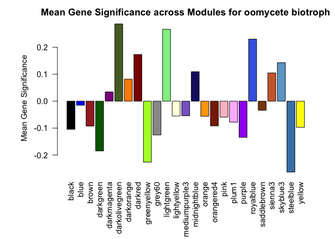<!-- -->

Different ways on calculating hub genes:

intramodular connectivity (kIM): measures how connected a gene is within
its module (intramodularConnectivity)

kME: module membership (simpler to calculate, has an associated p-value
and can be compared across modules)

signedKME: Calculation of (signed) eigengene-based connectivity, also
known as module membership, correlation of the gene with the
corresponding module eigengene.

``` r
# identify top hub gene per module
hubGenes = chooseTopHubInEachModule(input_mat, picked_module_colors)
print(hubGenes)
```

    ##          black           blue          brown      darkgreen    darkmagenta 
    ##    "AT3G45960"    "AT1G65230"    "AT5G12970"    "AT1G04270"    "AT5G36970" 
    ## darkolivegreen     darkorange        darkred    greenyellow         grey60 
    ##    "AT3G49790"    "AT3G09735"    "AT3G52400"    "AT5G01260"    "ATMG00560" 
    ##     lightgreen    lightyellow  mediumpurple3   midnightblue         orange 
    ##    "AT1G15670"    "AT3G49307"    "AT5G39430"    "AT3G33530"    "AT3G04400" 
    ##     orangered4           pink          plum1         purple      royalblue 
    ##    "AT1G27461"    "ATCG00420"    "AT5G53800"    "AT5G26830"    "AT4G23230" 
    ##    saddlebrown        sienna3       skyblue3      steelblue         yellow 
    ##    "AT5G35840"    "AT3G07010"    "AT3G05600"    "AT1G41830"    "AT3G62170"

``` r
kWithin = softConnectivity(input_mat, type = "signed hybrid")
```

    ##  softConnectivity: FYI: connecitivty of genes with less than 93 valid samples will be returned as NA.
    ##  ..calculating connectivities..

``` r
# identify more hub genes per module based on gene significance
#gene_info_GS <- data.frame(
 # Gene = colnames(input_mat),
  #Module = picked_module_colors,  
  #kME = apply(geneModuleMembership, 1, max),
  #GS = abs(geneTraitSignificance_inf_path[,-15]),
  #kWithin = kWithin
#)

# select top hub genes per module based on kME and kWithin
#hub_genes_GS <- gene_info_GS %>%
 # group_by(Module) %>%
  #arrange(desc(kWithin), desc(kME)) %>%
  #slice_head(n = 5) 

# not based on gene significance
gene_info <- data.frame(
  Gene = colnames(input_mat),
  Module = picked_module_colors,
  kME = apply(geneModuleMembership, 1, max),  
  kWithin = kWithin  
)
hub_genes <- gene_info %>%
  group_by(Module) %>%
  arrange(desc(kWithin), desc(kME)) #%>%
  #slice_head(n = 10) 

# choose hub genes based on module membership (signedKME)
kMEtable <- signedKME(input_mat, MEs)

# scale by max = TRUE --> make it comparable across modules
kIM_scaled <- intramodularConnectivity.fromExpr(input_mat, picked_module_colors, networkType = "signed hybrid", scaleByMax = TRUE, power = 4)
```

    ##  softConnectivity: FYI: connecitivty of genes with less than 93 valid samples will be returned as NA.
    ##  ..calculating connectivities..

``` r
kIM <- intramodularConnectivity.fromExpr(input_mat, picked_module_colors, networkType = "signed hybrid", power = 4)
```

    ##  softConnectivity: FYI: connecitivty of genes with less than 93 valid samples will be returned as NA.
    ##  ..calculating connectivities..

``` r
# look at specific module that has high significance with choosen trait
module = "darkgreen"
category = "nematode"
column = match(module, modNames)
moduleGenes = picked_module_colors==module

# in modules related to the trait of interest, genes with high module membership often also have high gene significance

#pdf("~/Studium/bachelor-thesis-luisa/plots/GS_vs_MM_TuMV_magenta.pdf")
verboseScatterplot(geneModuleMembership[moduleGenes,column],
geneTraitSignificance_sub_cat[moduleGenes,category],
xlab = paste("Module Membership in", module, "module"),
ylab = paste("Gene significance for ", category),
main = paste("Module membership vs. gene significance\n"),
cex.main = 1.2, cex.lab = 1.2, cex.axis = 1.2, col = module)
```

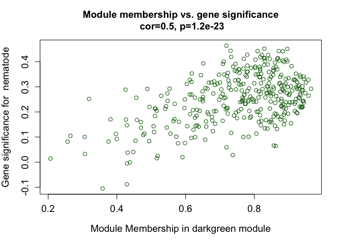<!-- -->

``` r
#abline(h=0.5, v=0.8, col="red")
#dev.off()
```

``` r
# calculate hub genes based on a MM and a GS cutoff
hub_genes_GS_MM <- function(MM, GS, module, trait, MM_cutoff, GS_cutoff){
  
  MM_table <- MM %>% rownames_to_column(var = "GeneID")
  GS_table <- GS %>% rownames_to_column(var = "GeneID")
  
  hub_data <- merge(data.frame(MM = MM_table[, module],GeneID = MM_table[, "GeneID"]),data.frame(GS = GS_table[,trait], GeneID = GS_table[, "GeneID"]), by = "GeneID")
  
  hub_genes <- hub_data %>% filter(MM > MM_cutoff & GS > GS_cutoff)
  
  return(hub_genes)
}

hub_genes_biotroph_darkred <- hub_genes_GS_MM(geneModuleMembership, geneTraitSignificance_cat, "MMdarkred", "biotroph", 0.8, 0.5)
hub_genes_biotroph_royalblue <- hub_genes_GS_MM(geneModuleMembership, geneTraitSignificance_cat, "MMroyalblue", "biotroph", 0.8, 0.5)
hub_genes_oomycete_royalblue <- hub_genes_GS_MM(geneModuleMembership, geneTraitSignificance_sub_cat, "MMroyalblue", "oomycete.biotroph", 0.8, 0.5)
hub_genes_nematode_brown <- hub_genes_GS_MM(geneModuleMembership, geneTraitSignificance_sub_cat, "MMbrown", "nematode", 0.8, 0.5)
hub_genes_nematode_darkgreen <- hub_genes_GS_MM(geneModuleMembership, geneTraitSignificance_sub_cat, "MMdarkgreen", "nematode", 0.8, 0.3)
hub_genes_hpa_darkolivegreen <- hub_genes_GS_MM(geneModuleMembership, geneTraitSignificance_inf_path, "MMdarkolivegreen", "Hpa", 0.8, 0.4)
```

``` r
MET = orderMEs(cbind(MEs, inf_path_df))
par(cex = 0.9)
#bottom, left, top, right
plotEigengeneNetworks(MET, "Eigengene dendrogram and adjacency heatmap - including pathogens", marDendro = c(1,5,2,2), marHeatmap = c(7,7,2,2), cex.lab = 0.8, xLabelsAngle = 90)
```

    ## Warning in mapply(textFnc, x = labPos$xMid[xTextLabInd], y = xLabYPos, labels =
    ## xLabels.show[xTextLabInd], : longer argument not a multiple of length of
    ## shorter
    ## Warning in mapply(textFnc, x = labPos$xMid[xTextLabInd], y = xLabYPos, labels =
    ## xLabels.show[xTextLabInd], : longer argument not a multiple of length of
    ## shorter
    ## Warning in mapply(textFnc, x = labPos$xMid[xTextLabInd], y = xLabYPos, labels =
    ## xLabels.show[xTextLabInd], : longer argument not a multiple of length of
    ## shorter
    ## Warning in mapply(textFnc, x = labPos$xMid[xTextLabInd], y = xLabYPos, labels =
    ## xLabels.show[xTextLabInd], : longer argument not a multiple of length of
    ## shorter

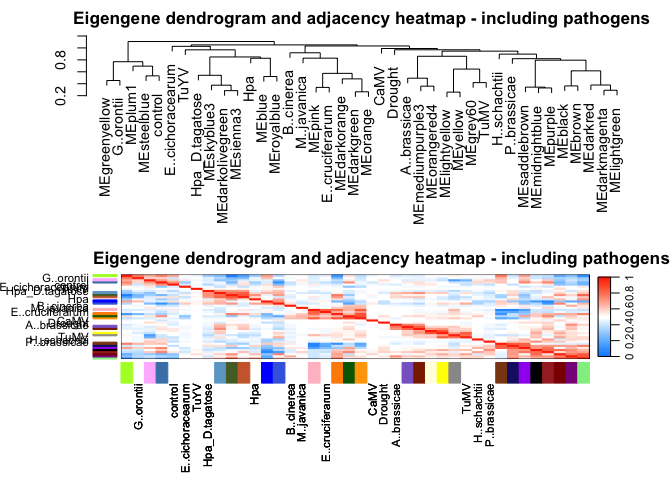<!-- -->

``` r
MET_cat <- orderMEs(cbind(MEs, cat_df))
par(cex = 0.9)
#bottom, left, top, right
plotEigengeneNetworks(MET_cat, "Eigengene dendrogram and adjacency heatmap - categories", marDendro = c(1,5,2,2), marHeatmap = c(7,7,2,2), cex.lab = 0.8, xLabelsAngle = 90)
```

    ## Warning in mapply(textFnc, x = labPos$xMid[xTextLabInd], y = xLabYPos, labels =
    ## xLabels.show[xTextLabInd], : longer argument not a multiple of length of
    ## shorter
    ## Warning in mapply(textFnc, x = labPos$xMid[xTextLabInd], y = xLabYPos, labels =
    ## xLabels.show[xTextLabInd], : longer argument not a multiple of length of
    ## shorter
    ## Warning in mapply(textFnc, x = labPos$xMid[xTextLabInd], y = xLabYPos, labels =
    ## xLabels.show[xTextLabInd], : longer argument not a multiple of length of
    ## shorter
    ## Warning in mapply(textFnc, x = labPos$xMid[xTextLabInd], y = xLabYPos, labels =
    ## xLabels.show[xTextLabInd], : longer argument not a multiple of length of
    ## shorter

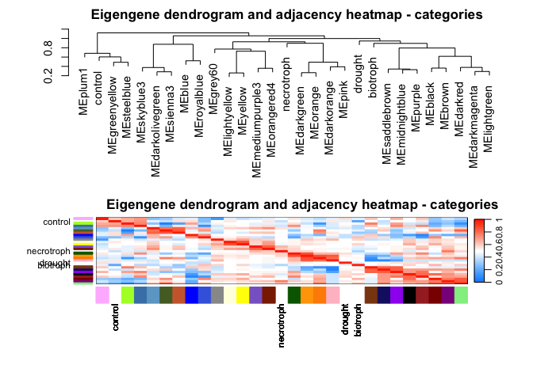<!-- -->

``` r
MET_sub_cat <- orderMEs(cbind(MEs, sub_cat_df))
par(cex = 0.9)
#bottom, left, top, right
plotEigengeneNetworks(MET_sub_cat, "Eigengene dendrogram and adjacency heatmap - subcategories", marDendro = c(1,5,2,2), marHeatmap = c(7,7,2,2), cex.lab = 0.8, xLabelsAngle = 90)
```

    ## Warning in mapply(textFnc, x = labPos$xMid[xTextLabInd], y = xLabYPos, labels =
    ## xLabels.show[xTextLabInd], : longer argument not a multiple of length of
    ## shorter
    ## Warning in mapply(textFnc, x = labPos$xMid[xTextLabInd], y = xLabYPos, labels =
    ## xLabels.show[xTextLabInd], : longer argument not a multiple of length of
    ## shorter
    ## Warning in mapply(textFnc, x = labPos$xMid[xTextLabInd], y = xLabYPos, labels =
    ## xLabels.show[xTextLabInd], : longer argument not a multiple of length of
    ## shorter
    ## Warning in mapply(textFnc, x = labPos$xMid[xTextLabInd], y = xLabYPos, labels =
    ## xLabels.show[xTextLabInd], : longer argument not a multiple of length of
    ## shorter

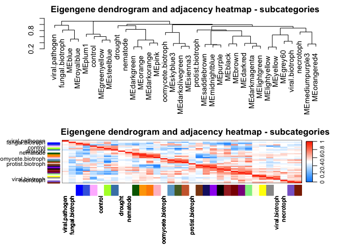<!-- -->

``` r
dist_matrix <- dist(t(MEs))

# Perform hierarchical clustering
hclust_modules <- hclust(dist_matrix, method = "average")
# Plot dendrogram
#plot(hclust_modules, main = "Hierarchical Clustering of Module Eigengenes", labels = names(MEs), cex = 0.7)
plotEigengeneNetworks(orderMEs(MEs), "Eigengene dendrogram and adjacency heatmap", marDendro = c(1,5,2,2), marHeatmap = c(7,7,2,2), cex.lab = 0.8, xLabelsAngle = 90)
```

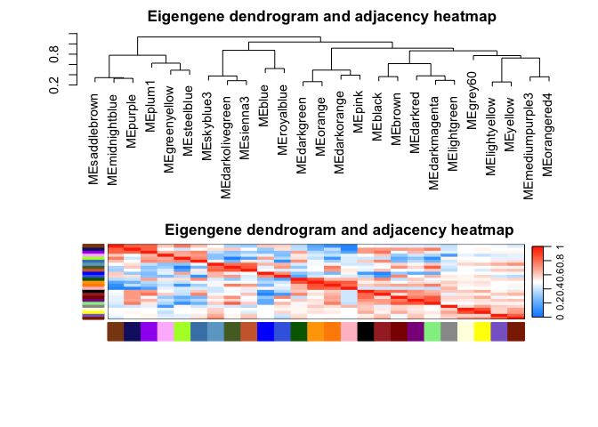<!-- -->

### Network analysis with functional annotation and gene ontology

–\> export a list of gene identifiers that can be used as input for
Mercator Enrichment analysis directly within R: -\> organism-specific
package: Genome wide annotation for Arabidopsis: org.At.tair.db

##### Functional enrichment for all genes per module:

``` r
# BP = biological processes
# CC = Cellular components
# MF = molecular functions

module_genes <- list()

# get genes from each module
for (module in modNames) {
  module_genes[[module]] <- colnames(input_mat)[moduleColors_pow4_tomsigned == module]
}

# get all GO enrichment results for each module
go_results <- list(BP = list(), CC = list(), MF = list())

for (module in names(module_genes)) {
  go_results$BP[[module]] <- enrichGO(
    gene = module_genes[[module]],
    OrgDb = org.At.tair.db,  
    keyType = "TAIR",
    ont = "BP",  
    pAdjustMethod = "BH",
    pvalueCutoff = 0.05
  )
  
  go_results$CC[[module]] <- enrichGO(
    gene = module_genes[[module]],
    OrgDb = org.At.tair.db,
    keyType = "TAIR",
    ont = "CC",  
    pAdjustMethod = "BH",
    pvalueCutoff = 0.05
  )
  
  go_results$MF[[module]] <- enrichGO(
    gene = module_genes[[module]],
    OrgDb = org.At.tair.db,
    keyType = "TAIR",
    ont = "MF", 
    pAdjustMethod = "BH",
    pvalueCutoff = 0.05
  )
}


# KEGG pathway enrichment results
kegg_results <- list()

for (module in names(module_genes)) {
  kegg_results[[module]] <- enrichKEGG(
    gene = module_genes[[module]],
    organism = "ath", 
    pAdjustMethod = "BH",
    pvalueCutoff = 0.05
  )
}
```

    ## Reading KEGG annotation online: "https://rest.kegg.jp/link/ath/pathway"...

    ## Reading KEGG annotation online: "https://rest.kegg.jp/list/pathway/ath"...

``` r
module_names <- unique(names(module_genes))
enrichment_table <- data.frame(Module = module_names, GO_BP = NA, GO_CC = NA, GO_MF = NA, KEGG = NA, stringsAsFactors = FALSE)


extract_top_term <- function(enrichment_result) {
  if (!is.null(enrichment_result) && nrow(enrichment_result@result) > 0) {
    return(enrichment_result@result$Description[1])  # return top enriched term
  } else {
    return(NA)  # NA if no enrichment
  }
}

for (module in module_names) {
  enrichment_table$GO_BP[enrichment_table$Module == module] <- extract_top_term(go_results$BP[[module]])
  enrichment_table$GO_CC[enrichment_table$Module == module] <- extract_top_term(go_results$CC[[module]])
  enrichment_table$GO_MF[enrichment_table$Module == module] <- extract_top_term(go_results$MF[[module]])
  enrichment_table$KEGG[enrichment_table$Module == module] <- extract_top_term(kegg_results[[module]])
}
print(enrichment_table)
```

    ##            Module                                                     GO_BP
    ## 1     saddlebrown               mitochondrial cytochrome c oxidase assembly
    ## 2    midnightblue                                          RNA modification
    ## 3          purple                      ribonucleoprotein complex biogenesis
    ## 4           plum1           RNA splicing, via transesterification reactions
    ## 5     greenyellow                proteinogenic amino acid metabolic process
    ## 6       steelblue                     monocarboxylic acid metabolic process
    ## 7        skyblue3                            stomatal complex morphogenesis
    ## 8  darkolivegreen                                          circadian rhythm
    ## 9         sienna3                               response to brassinosteroid
    ## 10           blue                                            photosynthesis
    ## 11      royalblue                                           immune response
    ## 12      darkgreen                                       ribosome biogenesis
    ## 13         orange                                  translational elongation
    ## 14     darkorange             protein localization to endoplasmic reticulum
    ## 15           pink endoplasmic reticulum to Golgi vesicle-mediated transport
    ## 16          black                              cellular response to hypoxia
    ## 17          brown                                 microtubule-based process
    ## 18        darkred                              cellular response to hypoxia
    ## 19    darkmagenta                                           immune response
    ## 20     lightgreen                                        response to fungus
    ## 21         grey60            generation of precursor metabolites and energy
    ## 22    lightyellow                                           lipid transport
    ## 23         yellow                                               pollination
    ## 24  mediumpurple3                              fatty acid catabolic process
    ## 25     orangered4                                             lipid storage
    ##                                                            GO_CC
    ## 1                                       organelle inner membrane
    ## 2                                                      chromatin
    ## 3                                                    preribosome
    ## 4                                           spliceosomal complex
    ## 5                                     chloroplast outer membrane
    ## 6                                            trans-Golgi network
    ## 7                                                   cell surface
    ## 8                                                  autophagosome
    ## 9                                                tubulin complex
    ## 10                                             plastid thylakoid
    ## 11                                                      apoplast
    ## 12                                             ribosomal subunit
    ## 13                                             ribosomal subunit
    ## 14 nuclear outer membrane-endoplasmic reticulum membrane network
    ## 15                             transmembrane transporter complex
    ## 16                                         CCR4-NOT core complex
    ## 17                                      microtubule cytoskeleton
    ## 18                                       extracellular organelle
    ## 19                                                    peroxisome
    ## 20                                endoplasmic reticulum membrane
    ## 21                                              plastid ribosome
    ## 22                                                      apoplast
    ## 23                                                   pollen tube
    ## 24                                                      stromule
    ## 25                                                 lipid droplet
    ##                                                                         GO_MF
    ## 1                                                   protein carrier chaperone
    ## 2                                                  molecular adaptor activity
    ## 3                                                           helicase activity
    ## 4                                                            pre-mRNA binding
    ## 5                     phosphotransferase activity, carboxyl group as acceptor
    ## 6  acyltransferase activity, transferring groups other than amino-acyl groups
    ## 7  acyltransferase activity, transferring groups other than amino-acyl groups
    ## 8                                 ubiquitin-like protein transferase activity
    ## 9                                                      pectate lyase activity
    ## 10                                           ATP-dependent peptidase activity
    ## 11                                                                ADP binding
    ## 12                                         structural constituent of ribosome
    ## 13                                               structural molecule activity
    ## 14                                     protein-macromolecule adaptor activity
    ## 15                      ATPase-coupled ion transmembrane transporter activity
    ## 16                        cis-regulatory region sequence-specific DNA binding
    ## 17                                                            tubulin binding
    ## 18                                                                ADP binding
    ## 19                                                               heme binding
    ## 20                                ubiquitin-like protein transferase activity
    ## 21                                                 electron transfer activity
    ## 22                                          pectinesterase inhibitor activity
    ## 23                                                           hormone activity
    ## 24                                       RNA-DNA hybrid ribonuclease activity
    ## 25                                                               heme binding
    ##                                                                                        KEGG
    ## 1                            Biosynthesis of cofactors - Arabidopsis thaliana (thale cress)
    ## 2                                          Endocytosis - Arabidopsis thaliana (thale cress)
    ## 3                    Ribosome biogenesis in eukaryotes - Arabidopsis thaliana (thale cress)
    ## 4                                          Spliceosome - Arabidopsis thaliana (thale cress)
    ## 5                          Biosynthesis of amino acids - Arabidopsis thaliana (thale cress)
    ## 6                              Fatty acid biosynthesis - Arabidopsis thaliana (thale cress)
    ## 7                                Fatty acid elongation - Arabidopsis thaliana (thale cress)
    ## 8                       MAPK signaling pathway - plant - Arabidopsis thaliana (thale cress)
    ## 9                                            Phagosome - Arabidopsis thaliana (thale cress)
    ## 10                                Porphyrin metabolism - Arabidopsis thaliana (thale cress)
    ## 11                          Plant-pathogen interaction - Arabidopsis thaliana (thale cress)
    ## 12                                            Ribosome - Arabidopsis thaliana (thale cress)
    ## 13                                            Ribosome - Arabidopsis thaliana (thale cress)
    ## 14                                      Protein export - Arabidopsis thaliana (thale cress)
    ## 15                           Oxidative phosphorylation - Arabidopsis thaliana (thale cress)
    ## 16                          Plant-pathogen interaction - Arabidopsis thaliana (thale cress)
    ## 17                        Phenylpropanoid biosynthesis - Arabidopsis thaliana (thale cress)
    ## 18                          Plant-pathogen interaction - Arabidopsis thaliana (thale cress)
    ## 19 Biosynthesis of various plant secondary metabolites - Arabidopsis thaliana (thale cress)
    ## 20         Protein processing in endoplasmic reticulum - Arabidopsis thaliana (thale cress)
    ## 21                           Oxidative phosphorylation - Arabidopsis thaliana (thale cress)
    ## 22                         Polycomb repressive complex - Arabidopsis thaliana (thale cress)
    ## 23            Pentose and glucuronate interconversions - Arabidopsis thaliana (thale cress)
    ## 24                      Ubiquitin mediated proteolysis - Arabidopsis thaliana (thale cress)
    ## 25                   Plant hormone signal transduction - Arabidopsis thaliana (thale cress)

``` r
write.csv(enrichment_table, "~/Studium/bachelor-thesis-luisa/wgcna_results/module_enrichment.csv")
```

``` r
# plotting of enrichment results of specific module
module = "brown"

# simplify enrichGO output by removing redundancy of enriched GO terms
simple_enriched_go <- simplify(go_results$BP[[module]])

simple_enriched_go %>% filter(p.adjust < 0.05) %>%
ggplot(showCategory = 20,
  aes(GeneRatio, forcats::fct_reorder(Description, GeneRatio))) + 
  geom_segment(aes(xend=0, yend = Description)) +
  geom_point(aes(color=p.adjust, size = Count)) +
  scale_color_viridis_c(guide=guide_colorbar(reverse=TRUE)) +
  scale_size_continuous(range=c(1, 7)) +
  theme_minimal() + 
  xlab("Gene Ratio") +
  ylab(NULL) + 
  ggtitle(paste("GO Enrichment of", module, "module"))
```

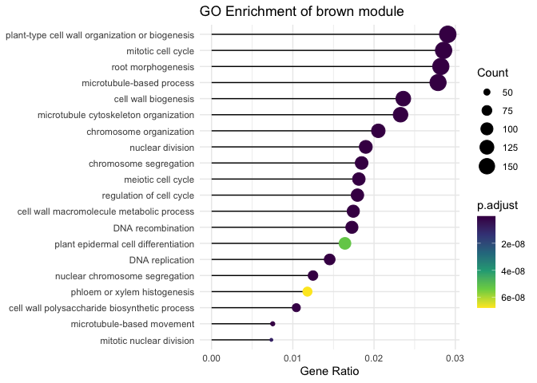<!-- -->

``` r
goplot(simple_enriched_go, showCategory = 5)
```

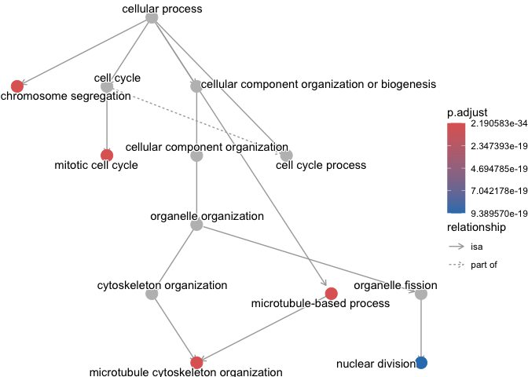<!-- -->

``` r
cnetplot(simple_enriched_go)
```

    ## Warning: ggrepel: 322 unlabeled data points (too many overlaps). Consider
    ## increasing max.overlaps

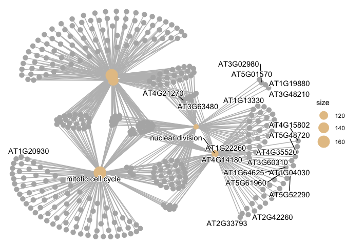<!-- -->

Functional enrichment for hub genes based on signedkME \> 0.8:

``` r
hub_genes_per_module <- list()

for (mod in modNames) {
  hub_genes_per_module[[mod]] <- rownames(kMEtable)[which(kMEtable[, paste0("kME", mod)] > 0.8)] 
}


go_results_hub_compared <- compareCluster(geneCluster = hub_genes_per_module,
                             fun = "enrichGO",
                             OrgDb = org.At.tair.db,
                             keyType = "TAIR",
                             ont = "BP",
                             pAdjustMethod = "BH")


go_result_hub_simplified <- simplify(go_results_hub_compared)

go_result_hub_simplified %>% 
  filter(p.adjust < 0.05) %>%
  ggplot(aes(x = Cluster, y = forcats::fct_reorder(Description, GeneRatio))) + 
  geom_segment(aes(xend = Cluster, yend = Description)) +
  geom_point(aes(color = p.adjust, size = Count)) +
  scale_color_viridis_c(guide = guide_colorbar(reverse = TRUE)) +
  scale_size_continuous(range = c(1, 7)) +
  theme_minimal() + 
  theme(axis.text.x = element_text(angle = 45, hjust = 1, size = 10),
        axis.text.y = element_text(size = 8)) + 
  xlab("Module") +
  ylab(NULL) + 
  ggtitle("GO Enrichment of Module Hub Genes")
```

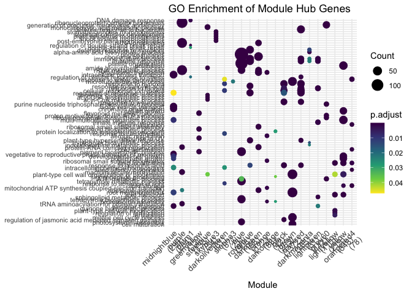<!-- -->

``` r
# get all GO enrichment results for hub genes of each module
go_results_hub_genes <- list(BP = list(), CC = list(), MF = list())


for (module in names(hub_genes_per_module)) {
  go_results_hub_genes$BP[[module]] <- enrichGO(
    gene = hub_genes_per_module[[module]],
    OrgDb = org.At.tair.db,  
    keyType = "TAIR",
    ont = "BP",  
    pAdjustMethod = "BH",
    pvalueCutoff = 0.05
  )
  
  go_results_hub_genes$CC[[module]] <- enrichGO(
    gene = hub_genes_per_module[[module]],
    OrgDb = org.At.tair.db,
    keyType = "TAIR",
    ont = "CC",  
    pAdjustMethod = "BH",
    pvalueCutoff = 0.05
  )
  
  go_results_hub_genes$MF[[module]] <- enrichGO(
    gene = hub_genes_per_module[[module]],
    OrgDb = org.At.tair.db,
    keyType = "TAIR",
    ont = "MF", 
    pAdjustMethod = "BH",
    pvalueCutoff = 0.05
  )
}


# Get KEGG pathway enrichment results
kegg_hub_results <- list()

for (module in names(hub_genes_per_module)) {
  kegg_hub_results[[module]] <- enrichKEGG(
    gene = hub_genes_per_module[[module]],
    organism = "ath", 
    pAdjustMethod = "BH",
    pvalueCutoff = 0.05
  )
}

#browseKEGG()
```

``` r
saveRDS(go_results_hub_genes, file = "~/Studium/bachelor-thesis-luisa/data/go_results_hub_genes.rds")
saveRDS(kegg_hub_results, file = "~/Studium/bachelor-thesis-luisa/data/kegg_hub_genes.rds")
go_results_hub_genes <-readRDS("~/Studium/bachelor-thesis-luisa/data/go_results_hub_genes.rds")
kegg_hub_results <- readRDS("~/Studium/bachelor-thesis-luisa/data/kegg_hub_genes.rds")
```

``` r
# plotting of enrichment results of specific module
module = "orange"

# simplify enrichGO output by removing redundancy of enriched GO terms
# plot with gene ratio
simple_enriched_go_bp <- simplify(go_results_hub_genes$BP[[module]])
simple_enriched_go_mf <- simplify(go_results_hub_genes$MF[[module]])
simple_enriched_go_cc <- simplify(go_results_hub_genes$CC[[module]])

simple_enriched_go_bp %>% filter(p.adjust < 0.05) %>%
ggplot(showCategory = 20,
  aes(GeneRatio, forcats::fct_reorder(Description, GeneRatio))) + 
  geom_segment(aes(xend=0, yend = Description)) +
  geom_point(aes(color=p.adjust, size = Count)) +
  scale_color_viridis_c(guide=guide_colorbar(reverse=TRUE)) +
  scale_size_continuous(range=c(1, 7)) +
  theme_minimal() + 
  xlab("Gene Ratio") +
  ylab(NULL) + 
  ggtitle(paste("GO Enrichment of", module, "module"))
```

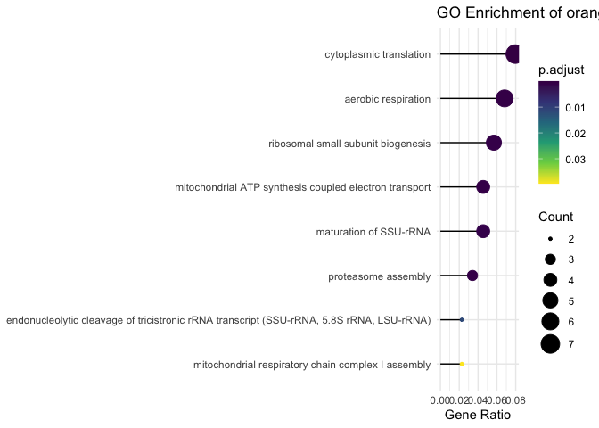<!-- -->

``` r
goplot(simple_enriched_go_bp, showCategory = 5)
```

    ## Warning: ggrepel: 7 unlabeled data points (too many overlaps). Consider
    ## increasing max.overlaps

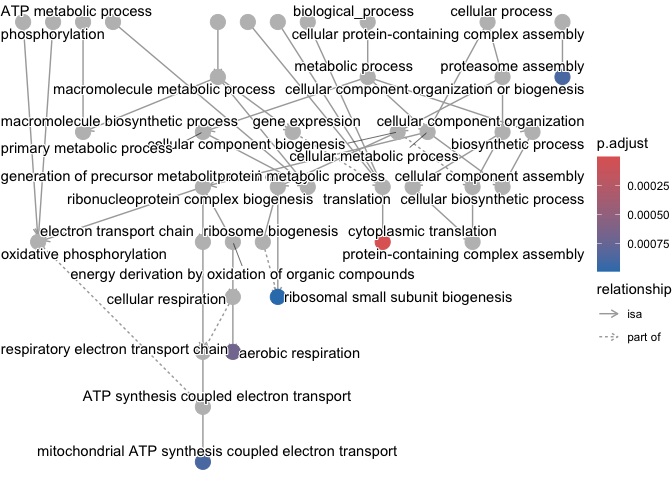<!-- -->

``` r
cnetplot(simple_enriched_go_bp)
```

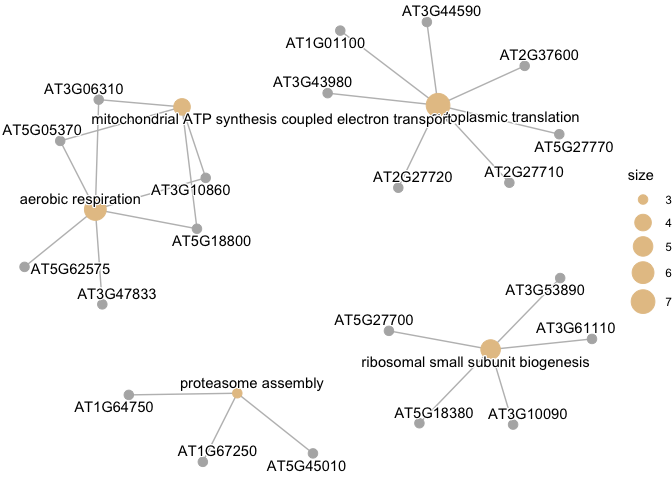<!-- -->

``` r
kegg_module <- kegg_hub_results[[module]]
head(kegg_module, n = 20)
```

    ##                                category                      subcategory
    ## ath03010 Genetic Information Processing                      Translation
    ## ath03050 Genetic Information Processing Folding, sorting and degradation
    ##                ID                                     Description GeneRatio
    ## ath03010 ath03010   Ribosome - Arabidopsis thaliana (thale cress)     37/57
    ## ath03050 ath03050 Proteasome - Arabidopsis thaliana (thale cress)      5/57
    ##           BgRatio RichFactor FoldEnrichment   zScore       pvalue     p.adjust
    ## ath03010 359/5609 0.10306407      10.141866 18.13924 4.228123e-31 9.301871e-30
    ## ath03050  61/5609 0.08196721       8.065861  5.62184 3.495562e-04 3.845118e-03
    ##                qvalue
    ## ath03010 8.011181e-30
    ## ath03050 3.311585e-03
    ##                                                                                                                                                                                                                                                                                                                                                                                     geneID
    ## ath03010 AT1G01100/AT1G07770/AT1G34030/AT1G56045/AT1G69620/AT2G25210/AT2G27710/AT2G27720/AT2G33370/AT2G37600/AT2G40205/AT2G43460/AT3G04400/AT3G08520/AT3G10090/AT3G18740/AT3G22230/AT3G23390/AT3G43980/AT3G44010/AT3G44590/AT3G47370/AT3G48930/AT3G53890/AT3G56020/AT3G59540/AT3G61110/AT4G25890/AT4G29390/AT4G31985/AT4G33865/AT5G02960/AT5G03850/AT5G18380/AT5G27700/AT5G27770/AT5G57290
    ## ath03050                                                                                                                                                                                                                                                                                                                                 AT1G64750/AT1G67250/AT1G77440/AT5G42790/AT5G45010
    ##          Count
    ## ath03010    37
    ## ath03050     5

Functional enrichment based on hub genes defined with a MM and GS
cutoff:

``` r
ego <- enrichGO(gene = hub_genes_nematode_brown$GeneID,
    OrgDb = org.At.tair.db,
    keyType = "TAIR",
    ont = "BP", 
    pAdjustMethod = "BH",
    pvalueCutoff = 0.05)

simple_ego <- simplify(ego)
simple_ego %>% filter(p.adjust < 0.05) %>%
  ggplot(showCategory = 20,
  aes(GeneRatio, forcats::fct_reorder(Description, GeneRatio))) + 
  geom_segment(aes(xend=0, yend = Description)) +
  geom_point(aes(color=p.adjust, size = Count)) +
  scale_color_viridis_c(guide=guide_colorbar(reverse=TRUE)) +
  scale_size_continuous(range=c(1, 7)) +
  theme_minimal() + 
  xlab("Gene Ratio") +
  ylab(NULL) + 
  ggtitle(paste("GO Enrichment of hub genes of brown module"))
```

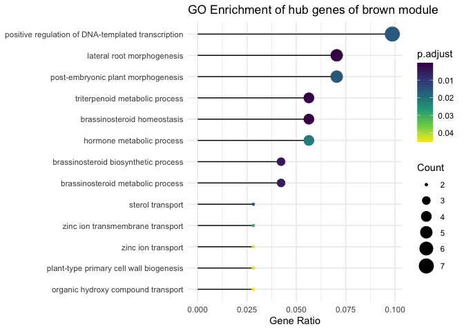<!-- -->

``` r
goplot(simple_ego, showCategory = 5)
```

    ## Warning: ggrepel: 1 unlabeled data points (too many overlaps). Consider
    ## increasing max.overlaps

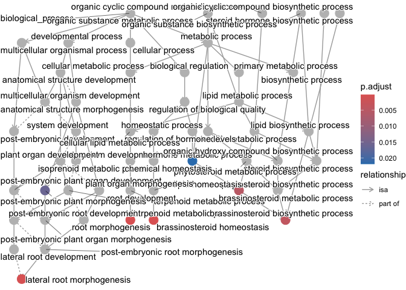<!-- -->

``` r
cnetplot(simple_ego)
```

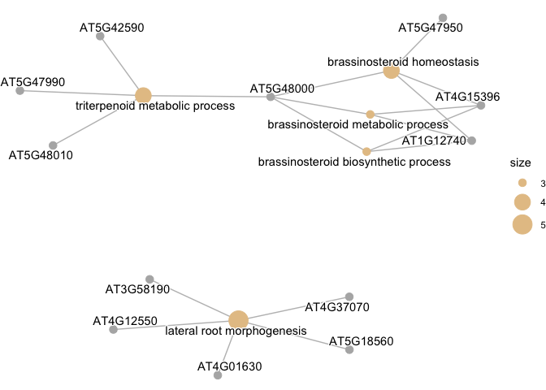<!-- -->
