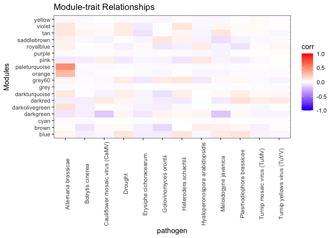
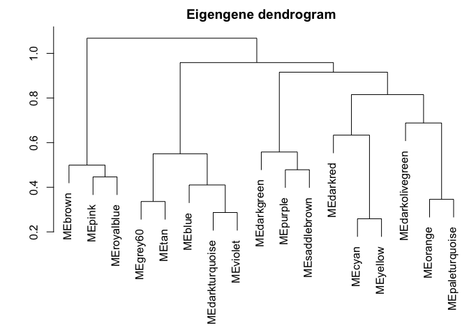
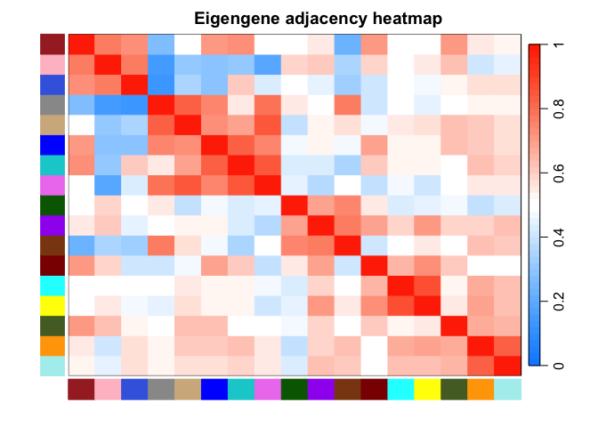

Weighted Gene Co-Expression Network Analysis
================
2025-01-13

``` r
# load packages
library(WGCNA)
```

    ## Loading required package: dynamicTreeCut

    ## Loading required package: fastcluster

    ## 
    ## Attaching package: 'fastcluster'

    ## The following object is masked from 'package:stats':
    ## 
    ##     hclust

    ## 

    ## 
    ## Attaching package: 'WGCNA'

    ## The following object is masked from 'package:stats':
    ## 
    ##     cor

``` r
library(dplyr)
```

    ## 
    ## Attaching package: 'dplyr'

    ## The following objects are masked from 'package:stats':
    ## 
    ##     filter, lag

    ## The following objects are masked from 'package:base':
    ## 
    ##     intersect, setdiff, setequal, union

``` r
library(ggplot2)
library(tidyr)
```

\#WGCNA - basic steps

### Data cleaning

1.  load normalized expression Data and transform so that rows = samples
    and cols = genes
2.  Identify outlier genes with WGCNA package -\> goodSamplesGenes
3.  Identify outlier samples with hierarchical clustering

``` r
# load expression data
options(stringsAsFactors = FALSE)
expr_data <- read.csv("~/Studium/bachelor-thesis-luisa/count_tables/vst_expression_data.csv", row.names = 1)

# transpose it for WGCNA
input_mat <- t(expr_data)
```

``` r
gsg = goodSamplesGenes(input_mat, verbose = 3)
```

    ##  Flagging genes and samples with too many missing values...
    ##   ..step 1

``` r
gsg$allOK # TRUE
```

    ## [1] TRUE

``` r
summary(gsg)
```

    ##             Length Class  Mode   
    ## goodGenes   24991  -none- logical
    ## goodSamples   265  -none- logical
    ## allOK           1  -none- logical

``` r
# Identifying outlier samples
sampleTree <- hclust(dist(input_mat), method = "average") #Clustering samples based on distance 

#Setting the graphical parameters
par(cex = 0.6);
par(mar = c(0,4,2,0))

#Plotting the cluster dendrogram
plot(sampleTree, main = "Sample clustering to detect outliers", sub="", xlab="", cex.lab = 1.5,
cex.axis = 1.5, cex.main = 2)
```

<!-- -->

### Network construction

Identify some sort of similarity measurement between pairs of genes -\>
represents the concordance of gene expression profiles across samples
–\> Pearson correlation coefficient 1. pick soft threshold and call
adjacency function

``` r
allowWGCNAThreads()
```

    ## Allowing multi-threading with up to 8 threads.

``` r
# set of soft-thresholding powers
powers = c(c(1:10), seq(from = 12, to = 20, by = 2))
sft <- pickSoftThreshold(input_mat, powerVector = powers, verbose = 5)
```

    ## pickSoftThreshold: will use block size 1790.
    ##  pickSoftThreshold: calculating connectivity for given powers...
    ##    ..working on genes 1 through 1790 of 24991
    ##    ..working on genes 1791 through 3580 of 24991
    ##    ..working on genes 3581 through 5370 of 24991
    ##    ..working on genes 5371 through 7160 of 24991
    ##    ..working on genes 7161 through 8950 of 24991
    ##    ..working on genes 8951 through 10740 of 24991
    ##    ..working on genes 10741 through 12530 of 24991
    ##    ..working on genes 12531 through 14320 of 24991
    ##    ..working on genes 14321 through 16110 of 24991
    ##    ..working on genes 16111 through 17900 of 24991
    ##    ..working on genes 17901 through 19690 of 24991
    ##    ..working on genes 19691 through 21480 of 24991
    ##    ..working on genes 21481 through 23270 of 24991
    ##    ..working on genes 23271 through 24991 of 24991
    ##    Power SFT.R.sq  slope truncated.R.sq mean.k. median.k. max.k.
    ## 1      1    0.567  1.170          0.984  6100.0  5980.000  10200
    ## 2      2    0.190 -0.348          0.888  2400.0  2110.000   6010
    ## 3      3    0.740 -0.970          0.894  1190.0   893.000   4090
    ## 4      4    0.816 -1.230          0.879   674.0   424.000   3010
    ## 5      5    0.828 -1.350          0.869   418.0   221.000   2330
    ## 6      6    0.824 -1.420          0.858   277.0   123.000   1870
    ## 7      7    0.839 -1.430          0.869   193.0    72.000   1530
    ## 8      8    0.852 -1.420          0.882   140.0    43.700   1280
    ## 9      9    0.860 -1.410          0.888   105.0    27.300   1090
    ## 10    10    0.873 -1.390          0.900    80.7    17.300    934
    ## 11    12    0.918 -1.330          0.941    50.8     7.420    707
    ## 12    14    0.952 -1.280          0.970    34.0     3.370    550
    ## 13    16    0.957 -1.270          0.979    24.0     1.620    451
    ## 14    18    0.955 -1.270          0.981    17.6     0.817    381
    ## 15    20    0.953 -1.270          0.982    13.3     0.423    326

``` r
sizeGrWindow(9,5)
par(mfrow = c(1,2));
cex1 = 0.9;
plot(sft$fitIndices[, 1],
     -sign(sft$fitIndices[, 3]) * sft$fitIndices[, 2],
     xlab = "Soft Threshold (power)",
     ylab = "Scale Free Topology Model Fit, signed R^2", type = "n",
     main = paste("Scale independence")
)
text(sft$fitIndices[, 1],
     -sign(sft$fitIndices[, 3]) * sft$fitIndices[, 2],
     labels = powers, cex = cex1, col = "red");

abline(h = 0.9, col = "red")
plot(sft$fitIndices[, 1],
     sft$fitIndices[, 5],
     xlab = "Soft Threshold (power)",
     ylab = "Mean Connectivity",
     type = "n",
     main = paste("Mean connectivity")
)
text(sft$fitIndices[, 1],
     sft$fitIndices[, 5],
     labels = powers,
     cex = cex1, col = "red")
```

### Module construction

1a. use hierarchical clustering to cluster the network into modules
(transform adjacency matrix into measures of gene dissimilarity) OR 1b.
use Topological Overlap Matrix (TOMsimilarity()) to define dissimilarity
2. dissimilarity/distance measures are then clustered using linkage
hierarchical clustering and a dendrogram of genes 3. identify the Module
Eigengene (standardized gene expression profile for a given module)
using moduleEigengenes() function

### Module merging

1.  cluster modules based on pairwise eigengene correlations and merge
    modules that have similar expression profiles

Run WGCNA_netconstr.R or WGCNA_auto_netconstr.R on the cluster.

Results for different soft powers:

``` r
# network construction with soft power 6
load('~/Studium/bachelor-thesis-luisa/wgcna_results/networkConstruction-pow6.RData')
moduleColors_pow6 <- mergedColors
MEs_pow6 <- mergedMEs
geneTree_pow6 <- geneTree

load('~/Studium/bachelor-thesis-luisa/wgcna_results/networkConstruction-pow7.RData')
moduleColors_pow7 <- mergedColors
MEs_pow7 <- mergedMEs
geneTree_pow7 <- geneTree

load('~/Studium/bachelor-thesis-luisa/wgcna_results/networkConstruction-pow5.RData')
moduleColors_pow5 <- mergedColors
MEs_pow5 <- mergedMEs
geneTree_pow5 <- geneTree

load('~/Studium/bachelor-thesis-luisa/wgcna_results/networkConstruction-pow8.RData')
moduleColors_pow8 <- mergedColors
MEs_pow8 <- mergedMEs
geneTree_pow8 <- geneTree
```

``` r
# plots the gene dendrogram with the module colors
plotDendroAndColors(geneTree_pow6, 
                    moduleColors_pow6,
                    "Module",
                    dendroLabels = FALSE, 
                    hang = 0.03,
                    addGuide = TRUE, 
                    guideHang = 0.05,
                    main = "Gene dendrogram and module colors")
```

<!-- -->

### External Trait Matching

1.  relate the network to external traits (meta Info)
2.  calculate the correlation of a trait of interest with previously
    identified module eigengenes –\> gene significance

eigengene = summary profile for each module –\> correlate eigengenes
with external traits and look for the most significant associations

``` r
# loading meta data
metaData <- read.csv("~/Studium/bachelor-thesis-luisa/data/metaData.csv", sep=";")
metaData$Timepoint_dpi <- metaData$Timepoint..dpi.
metaData$infected_control <- metaData$infected.control.num
metaData$single_paired <- ifelse(metaData$single.paired =="single", 1,0)
# create pathogen column
metaData$pathogen <- ifelse(metaData$Experiment == "Heterodera schachtii 2", "Heterodera schachtii", metaData$Experiment)
metaData$pathogen <- ifelse(metaData$Experiment == "Hyaloperonospora arabidopsidis 3", "Hyaloperonospora arabidopsidis", metaData$pathogen)
metaData$pathogen <- ifelse(metaData$Experiment == "Plasmodiophora brassicae 2", "Plasmodiophora brassicae", metaData$pathogen)
metaData$pathogen <- ifelse(metaData$Experiment == "Turnip mosaic virus (TuMV) 3", "Turnip mosaic virus (TuMV)", metaData$pathogen)
metaData <- metaData[, -c(3,4,5)]

# get pathogen abbreviations
metaData$pathogen_abbr <- ifelse(metaData$pathogen == "Heterodera schachtii", "H. schachtii", metaData$pathogen)
metaData$pathogen_abbr <- ifelse(metaData$pathogen == "Alternaria brassicae", "A. brassicae", metaData$pathogen_abbr)
metaData$pathogen_abbr <- ifelse(metaData$pathogen == "Botrytis cinerea", "B. cinerea", metaData$pathogen_abbr)
metaData$pathogen_abbr <- ifelse(metaData$pathogen == "Cauliflower mosaic virus (CaMV)", "CaMV", metaData$pathogen_abbr)
metaData$pathogen_abbr <- ifelse(metaData$pathogen == "Turnip mosaic virus (TuMV)", "TuMV", metaData$pathogen_abbr)
metaData$pathogen_abbr <- ifelse(metaData$pathogen == "Turnip yellows virus (TuYV)", "TuYV", metaData$pathogen_abbr)
metaData$pathogen_abbr <- ifelse(metaData$pathogen == "Turnip yellows virus (TuYV)", "TuYV", metaData$pathogen_abbr)
metaData$pathogen_abbr <- ifelse(metaData$pathogen == "Golovinomyces orontii", "G. orontii", metaData$pathogen_abbr)
metaData$pathogen_abbr <- ifelse(metaData$pathogen == "Erysiphe cichoracearum ", "E. cichoracearum", metaData$pathogen_abbr)    
metaData$pathogen_abbr <- ifelse(metaData$pathogen == "Hyaloperonospora arabidopsidis", "Hpa", metaData$pathogen_abbr)
metaData$pathogen_abbr <- ifelse(metaData$pathogen == "Meloidogyne javanica", "M. javanica", metaData$pathogen_abbr)
metaData$pathogen_abbr <- ifelse(metaData$pathogen == "Plasmodiophora brassicae", "P. brassicae", metaData$pathogen_abbr)

metaData_num <- metaData[,c(1,5,6,7,8)]

samples = rownames(input_mat)
metaRows = match(samples, metaData_num$Run)
metData = metaData_num[metaRows, -1]
rownames(metData) <- metaData_num[metaRows, 1]
```

``` r
# Define numbers of genes and samples
nGenes = ncol(input_mat);
nSamples = nrow(input_mat);
picked_module_colors = moduleColors_pow5

library(caret)
```

    ## Loading required package: lattice

``` r
# create meta data table with pathogens as columns
dummyVarsObject <- dummyVars(~ pathogen_abbr, data = metaData)
metaData_num2 <- cbind(metaData, predict(dummyVarsObject, newdata = metaData))
metaData_num2 <- metaData_num2[,-c(9,10)]

# Recalculate MEs with color labels
MEs0 = moduleEigengenes(input_mat, picked_module_colors)$eigengenes
MEs = orderMEs(MEs0)

# rest meta info
moduleTraitCor = cor(MEs, metaData_num[,-1], use = "p"); # pearson correlation
```

    ## Warning in storage.mode(y) <- "double": NAs introduced by coercion

``` r
moduleTraitPvalue = corPvalueStudent(moduleTraitCor, nSamples);

# calculate correlation based on pathogens
moduleTraitCor_path = cor(MEs, metaData_num2[, grep("pathogen_abbr", colnames(metaData_num2))], use = "p") 
moduleTraitPvalue_path = corPvalueStudent(moduleTraitCor, nSamples)
```

``` r
sizeGrWindow(10,6)
textMatrix = paste(signif(moduleTraitCor, 2), "\n(",
                   signif(moduleTraitPvalue, 1), ")", sep = "")

dim(textMatrix) = dim(moduleTraitCor)
par(mar = c(6, 8.5, 3, 3))

# plot meta info
labeledHeatmap(Matrix = moduleTraitCor,
               xLabels = names(metaData_num[,-1]),
               yLabels = names(MEs),
               ySymbols = names(MEs),
               colorLabels = FALSE,
               colors = greenWhiteRed(50),
               textMatrix = textMatrix,
               setStdMargins = FALSE,
               cex.text = 0.5,
               zlim = c(-1,1),
               main = paste("Module-trait relationships"))
```

    ## Warning in greenWhiteRed(50): WGCNA::greenWhiteRed: this palette is not suitable for people
    ## with green-red color blindness (the most common kind of color blindness).
    ## Consider using the function blueWhiteRed instead.

``` r
# plot pathogens
textMatrix_path = paste(signif(moduleTraitCor_path, 2), "\n(",
                   signif(moduleTraitPvalue_path, 1), ")", sep = "")

dim(textMatrix_path) = dim(moduleTraitCor_path)
#par(mar = c(6, 8.5, 3, 3))

labeledHeatmap(Matrix = moduleTraitCor_path,
               xLabels = colnames(metaData_num2[, grep("pathogen_abbr", colnames(metaData_num2))]) %>% gsub("pathogen_abbr", "", .),
               yLabels = names(MEs),
               ySymbols = names(MEs),
               colorLabels = FALSE,
               colors = greenWhiteRed(50),
               textMatrix = textMatrix_path,
               setStdMargins = FALSE,
               cex.text = 0.5,
               zlim = c(-1,1),
               main = paste("Module-trait relationships with Pathogens"))
```

    ## Warning in greenWhiteRed(50): WGCNA::greenWhiteRed: this palette is not suitable for people
    ## with green-red color blindness (the most common kind of color blindness).
    ## Consider using the function blueWhiteRed instead.

``` r
module_order = names(MEs0) %>% gsub("ME","", .)
# add experiment to data
MEs0$treatment = row.names(MEs0)
MEs0 <- merge(MEs0,metaData, by.x = "treatment", by.y = "Run", all = TRUE)

# plot data
mME = MEs0 %>%
  pivot_longer(-c(treatment, Timepoint_dpi, infected.control.num, infection, infected_control, single_paired, avgSpotLen, pathogen, Experiment, pathogen_abbr)) %>%
  mutate(
    name = gsub("ME", "", name),
    name = factor(name, levels = module_order)
  )

mME %>% ggplot(., aes(x=pathogen, y=name, fill=value)) +
  geom_tile() +
  theme_bw() +
  scale_fill_gradient2(
    low = "blue",
    high = "red",
    mid = "white",
    midpoint = 0,
    limit = c(-1,1)) +
  theme(axis.text.x = element_text(angle=90)) +
  labs(title = "Module-trait Relationships", y = "Modules", fill="corr")
```

<!-- -->

We quantify associations of individual genes with our trait of interest
(weight) by defining Gene Significance GS as (the absolute value of) the
correlation between the gene and the trait. For each module, we also
define a quantitative measure of module membership MM as the correlation
of the module eigengene and the gene expression profile. This allows us
to quantify the similarity of all genes on the array to every module.

``` r
# identify hub genes
hubGenes = chooseTopHubInEachModule(input_mat, picked_module_colors)
print(hubGenes) 
```

    ##           blue          brown           cyan      darkgreen darkolivegreen 
    ##  "AT2G16570.1"  "AT1G15670.1"  "AT3G49307.1"  "AT2G28290.1"  "AT5G36970.1" 
    ##        darkred  darkturquoise         grey60         orange  paleturquoise 
    ##  "AT2G34600.1"  "AT4G23800.1"  "AT1G79150.1"  "AT1G27461.1"  "AT5G39430.1" 
    ##           pink         purple      royalblue    saddlebrown            tan 
    ##  "AT1G66465.1"  "ATMG01360.1"  "AT1G02620.1"  "ATCG00740.1"  "AT3G48930.1" 
    ##         violet         yellow 
    ##  "AT3G46940.1"  "AT3G62170.1"

### Target Gene Identification

1.  use gene significance along with the genes intramodular connectivity
    to identify potential target genes associated with a particular
    trait of interest –\> Using the gene significance you can identify
    genes that have a high significance for weight. Using the module
    membership measures you can identify genes with high module
    membership in interesting modules.

Connectivity: how connected a speficic node is in the network (how many
nodes have high correlation with that node). High connectivity indicates
a hub gene (central to many nodes). Whole Network connectivity - a
measure for how well the node is connected throughout the entire system
Intramodular connectivity - a measure for how well the node is connected
within its assigned module. Also an indicator for how well that node
belongs to its module. This is also known as module membership.

``` r
# define a pathogen variable containing the pathogen column
TuMV = as.data.frame(metaData_num2$pathogen_abbrTuMV)
names(TuMV) = "TuMV"
rownames(TuMV) = rownames(metData)

Hpa = as.data.frame(metaData_num2$pathogen_abbrHpa)
names(Hpa) = "Hpa"
rownames(Hpa) = rownames(metData)

Gorontii = as.data.frame(metaData_num2$`pathogen_abbrG. orontii`)
names(Gorontii) = "G. orontii"
rownames(Gorontii) = rownames(metData)

Hschachtii = as.data.frame(metaData_num2$`pathogen_abbrH. schachtii`)
names(Hschachtii) = "H. schachtii"
rownames(Hschachtii) = rownames(metData)

picked_MEs <- MEs_pow5
modNames = substring(names(picked_MEs), 3) #extract module names

#Calculate the module membership and the associated p-values for every gene and module
geneModuleMembership = as.data.frame(cor(input_mat, picked_MEs, use = "p"))
MMPvalue = as.data.frame(corPvalueStudent(as.matrix(geneModuleMembership), nSamples)) # calculate student p-value for given correlations
names(geneModuleMembership) = paste("MM", modNames, sep="")
names(MMPvalue) = paste("p.MM", modNames, sep="")
```

``` r
#Calculate the gene significance and associated p-values for specific trait (pathogen)
geneTraitSignificance = as.data.frame(cor(input_mat, TuMV, use = "p"))
GSPvalue = as.data.frame(corPvalueStudent(as.matrix(geneTraitSignificance), nSamples))
names(geneTraitSignificance) = paste("GS.", names(TuMV), sep="")
names(GSPvalue) = paste("p.GS.", names(TuMV), sep="")


# look at specific module that has high significance with choosen trait
module = "yellow"
column = match(module, modNames)
moduleGenes = picked_module_colors==module

#pdf("~/Studium/bachelor-thesis-luisa/plots/GS_vs_MM_TuMV_magenta.pdf")
verboseScatterplot(abs(geneModuleMembership[moduleGenes,column]),
abs(geneTraitSignificance[moduleGenes,1]),
xlab = paste("Module Membership in", module, "module"),
ylab = "Gene significance for TuMV",
main = paste("Module membership vs. gene significance\n"),
cex.main = 1.2, cex.lab = 1.2, cex.axis = 1.2, col = module)
```

<!-- -->

``` r
#dev.off()
```

``` r
plot_geneSignificance_MM <- function(pathogen_name,pathogen_abbr, module){
  pathogen = as.data.frame(metaData_num2$pathogen_abbr)
  names(pathogen) = pathogen_name
  rownames(pathogen) = rownames(metData)
  
  # gene significance
  geneTraitSignificance = as.data.frame(cor(input_mat, pathogen, use = "p"))
  GSPvalue = as.data.frame(corPvalueStudent(as.matrix(geneTraitSignificance), nSamples))
  names(geneTraitSignificance) = paste("GS.", names(pathogen), sep="")
  names(GSPvalue) = paste("p.GS.", names(pathogen), sep="")
  head(GSPvalue)

  #plot
  column = match(module, modNames)
  moduleGenes = picked_module_colors==module
  verboseScatterplot(abs(geneModuleMembership[moduleGenes,column]),
  abs(geneTraitSignificance[moduleGenes,1]),
  xlab = paste("Module Membership in", module, "module"),
  ylab = paste("Gene significance for ", pathogen_name),
  main = paste("Module membership vs. gene significance\n"),
  cex.main = 1.2, cex.lab = 1.2, cex.axis = 1.2, col = module)
  }
```

``` r
MET = orderMEs(cbind(picked_MEs))
# Plot the relationships among the eigengenes and the trait
par(cex = 0.9)
plotEigengeneNetworks(MET, "", marDendro = c(0,4,1,2), marHeatmap = c(5,4,1,2), cex.lab = 0.8, xLabelsAngle
= 90)
```

<!-- -->

``` r
#sizeGrWindow(6,6);
par(cex = 1.0)
plotEigengeneNetworks(MET, "Eigengene dendrogram", marDendro = c(0,4,2,0),
plotHeatmaps = FALSE)
```

<!-- -->

``` r
# Plot the heatmap matrix (note: this plot will overwrite the dendrogram plot)
par(cex = 1.0)
plotEigengeneNetworks(MET, "Eigengene adjacency heatmap",  marHeatmap = c(3,4,2,2),
plotDendrograms = FALSE, xLabelsAngle = 90)
```

<!-- -->

### Network Visualization of Eigengenes

1.  study the relationship among found modules
2.  quantify module similarity by calculating the pairwise correlation
    of representative eigengenes

### Network analysis with functional annotation and gene ontology

–\> export a list of gene identifiers that can be used as input for
Mercator OR Enrichment analysis directly within R:

-\> organism-specific package: Genome wide annotation for Arabidopsis:
org.At.tair.db

``` r
library(clusterProfiler)
```

    ## clusterProfiler v4.14.4 Learn more at https://yulab-smu.top/contribution-knowledge-mining/
    ## 
    ## Please cite:
    ## 
    ## T Wu, E Hu, S Xu, M Chen, P Guo, Z Dai, T Feng, L Zhou, W Tang, L Zhan,
    ## X Fu, S Liu, X Bo, and G Yu. clusterProfiler 4.0: A universal
    ## enrichment tool for interpreting omics data. The Innovation. 2021,
    ## 2(3):100141

    ## 
    ## Attaching package: 'clusterProfiler'

    ## The following object is masked from 'package:lattice':
    ## 
    ##     dotplot

    ## The following object is masked from 'package:stats':
    ## 
    ##     filter

``` r
library(org.At.tair.db)
```

    ## Loading required package: AnnotationDbi

    ## Loading required package: stats4

    ## Loading required package: BiocGenerics

    ## 
    ## Attaching package: 'BiocGenerics'

    ## The following objects are masked from 'package:dplyr':
    ## 
    ##     combine, intersect, setdiff, union

    ## The following objects are masked from 'package:stats':
    ## 
    ##     IQR, mad, sd, var, xtabs

    ## The following objects are masked from 'package:base':
    ## 
    ##     anyDuplicated, aperm, append, as.data.frame, basename, cbind,
    ##     colnames, dirname, do.call, duplicated, eval, evalq, Filter, Find,
    ##     get, grep, grepl, intersect, is.unsorted, lapply, Map, mapply,
    ##     match, mget, order, paste, pmax, pmax.int, pmin, pmin.int,
    ##     Position, rank, rbind, Reduce, rownames, sapply, saveRDS, setdiff,
    ##     table, tapply, union, unique, unsplit, which.max, which.min

    ## Loading required package: Biobase

    ## Welcome to Bioconductor
    ## 
    ##     Vignettes contain introductory material; view with
    ##     'browseVignettes()'. To cite Bioconductor, see
    ##     'citation("Biobase")', and for packages 'citation("pkgname")'.

    ## Loading required package: IRanges

    ## Loading required package: S4Vectors

    ## 
    ## Attaching package: 'S4Vectors'

    ## The following object is masked from 'package:clusterProfiler':
    ## 
    ##     rename

    ## The following object is masked from 'package:tidyr':
    ## 
    ##     expand

    ## The following objects are masked from 'package:dplyr':
    ## 
    ##     first, rename

    ## The following object is masked from 'package:utils':
    ## 
    ##     findMatches

    ## The following objects are masked from 'package:base':
    ## 
    ##     expand.grid, I, unname

    ## 
    ## Attaching package: 'IRanges'

    ## The following object is masked from 'package:clusterProfiler':
    ## 
    ##     slice

    ## The following objects are masked from 'package:dplyr':
    ## 
    ##     collapse, desc, slice

    ## 
    ## Attaching package: 'AnnotationDbi'

    ## The following object is masked from 'package:clusterProfiler':
    ## 
    ##     select

    ## The following object is masked from 'package:dplyr':
    ## 
    ##     select

    ## 

``` r
# BP = biological processes
# CC = Cellular components
# MF = molecular functions

module_list <- unique(moduleColors_pow5)

module_genes <- list()

# get genes from each module
for (module in module_list) {
  module_genes[[module]] <- colnames(input_mat)[moduleColors_pow5 == module] %>% gsub("\\.1$", "", .)
}

# get all GO enrichment results for each module
go_results <- list(BP = list(), CC = list(), MF = list())

for (module in names(module_genes)) {
  go_results$BP[[module]] <- enrichGO(
    gene = module_genes[[module]],
    OrgDb = org.At.tair.db,  
    keyType = "TAIR",
    ont = "BP",  
    pAdjustMethod = "BH",
    pvalueCutoff = 0.05
  )
  
  go_results$CC[[module]] <- enrichGO(
    gene = module_genes[[module]],
    OrgDb = org.At.tair.db,
    keyType = "TAIR",
    ont = "CC",  
    pAdjustMethod = "BH",
    pvalueCutoff = 0.05
  )
  
  go_results$MF[[module]] <- enrichGO(
    gene = module_genes[[module]],
    OrgDb = org.At.tair.db,
    keyType = "TAIR",
    ont = "MF", 
    pAdjustMethod = "BH",
    pvalueCutoff = 0.05
  )
}
```

    ## No gene sets have size between 10 and 500 ...

    ## --> return NULL...

``` r
# Get KEGG pathway enrichment results
kegg_results <- list()

for (module in names(module_genes)) {
  kegg_results[[module]] <- enrichKEGG(
    gene = module_genes[[module]],
    organism = "ath", 
    pAdjustMethod = "BH",
    pvalueCutoff = 0.05
  )
}
```

    ## Reading KEGG annotation online: "https://rest.kegg.jp/link/ath/pathway"...

    ## Reading KEGG annotation online: "https://rest.kegg.jp/list/pathway/ath"...

    ## --> No gene can be mapped....

    ## --> Expected input gene ID: AT1G77490,AT5G56350,AT3G08590,AT5G66280,AT4G34240,AT3G05620

    ## --> return NULL...

``` r
module_names <- unique(names(module_genes))
enrichment_table <- data.frame(Module = module_names, GO_BP = NA, GO_CC = NA, GO_MF = NA, KEGG = NA, stringsAsFactors = FALSE)


extract_top_term <- function(enrichment_result) {
  if (!is.null(enrichment_result) && nrow(enrichment_result@result) > 0) {
    return(enrichment_result@result$Description[1])  # return top enriched term
  } else {
    return(NA)  # NA if no enrichment
  }
}

for (module in module_names) {
  enrichment_table$GO_BP[enrichment_table$Module == module] <- extract_top_term(go_results$BP[[module]])
  enrichment_table$GO_CC[enrichment_table$Module == module] <- extract_top_term(go_results$CC[[module]])
  enrichment_table$GO_MF[enrichment_table$Module == module] <- extract_top_term(go_results$MF[[module]])
  enrichment_table$KEGG[enrichment_table$Module == module] <- extract_top_term(kegg_results[[module]])
}
print(enrichment_table)
```

    ##            Module                                                     GO_BP
    ## 1            blue                                            photosynthesis
    ## 2             tan                                   cytoplasmic translation
    ## 3          orange                                             lipid storage
    ## 4           brown                                   Golgi vesicle transport
    ## 5          grey60                      ribonucleoprotein complex biogenesis
    ## 6       royalblue                            stomatal complex morphogenesis
    ## 7          yellow                                               pollination
    ## 8   darkturquoise                                        mitotic cell cycle
    ## 9         darkred                              cellular response to hypoxia
    ## 10           pink                             defense response to bacterium
    ## 11      darkgreen                                      chromatin remodeling
    ## 12         purple                                  electron transport chain
    ## 13           cyan                                           lipid transport
    ## 14 darkolivegreen                               cytochrome complex assembly
    ## 15         violet                                           DNA replication
    ## 16           grey                 plant-type secondary cell wall biogenesis
    ## 17    saddlebrown                                       aerobic respiration
    ## 18  paleturquoise negative regulation of transcription by RNA polymerase II
    ##                                                GO_CC
    ## 1                                  plastid thylakoid
    ## 2                                 cytosolic ribosome
    ## 3                                      lipid droplet
    ## 4               endoplasmic reticulum subcompartment
    ## 5                                        preribosome
    ## 6  RNA polymerase II transcription regulator complex
    ## 7                                        pollen tube
    ## 8                                       cytoskeleton
    ## 9                              CCR4-NOT core complex
    ## 10                               trans-Golgi network
    ## 11                                         chromatin
    ## 12                    photosystem II reaction center
    ## 13                                          apoplast
    ## 14                                COPII vesicle coat
    ## 15                                        chromosome
    ## 16                                              <NA>
    ## 17                                  plastid ribosome
    ## 18                       histone deacetylase complex
    ##                                                                                                                                                                                          GO_MF
    ## 1                                                                                                                                                                         tetrapyrrole binding
    ## 2                                                                                                                                                           structural constituent of ribosome
    ## 3  oxidoreductase activity, acting on paired donors, with incorporation or reduction of molecular oxygen, reduced flavin or flavoprotein as one donor, and incorporation of one atom of oxygen
    ## 4                                                                                                                                                                                SNARE binding
    ## 5                                                                                                                                                                               snoRNA binding
    ## 6                                                                                                                                                           xylan 1,4-beta-xylosidase activity
    ## 7                                                                                                                                                                             hormone activity
    ## 8                                                                                                                                                                 cytoskeletal protein binding
    ## 9                                                                                                                                                                          calcium ion binding
    ## 10                                                                                                                                                    receptor serine/threonine kinase binding
    ## 11                                                                                                                                                                           chromatin binding
    ## 12                                                                                                                                                                  electron transfer activity
    ## 13                                                                                                                                                           pectinesterase inhibitor activity
    ## 14                                                                                                                                                            glutathione transferase activity
    ## 15                                                                                                                                                              DNA replication origin binding
    ## 16                                                                                                                                                         structural constituent of chromatin
    ## 17                                                                                                                                                          structural constituent of ribosome
    ## 18                                                                                                                                                        RNA-DNA hybrid ribonuclease activity
    ##                                                                                KEGG
    ## 1                 Phenylpropanoid biosynthesis - Arabidopsis thaliana (thale cress)
    ## 2                                     Ribosome - Arabidopsis thaliana (thale cress)
    ## 3            Plant hormone signal transduction - Arabidopsis thaliana (thale cress)
    ## 4  Protein processing in endoplasmic reticulum - Arabidopsis thaliana (thale cress)
    ## 5            Ribosome biogenesis in eukaryotes - Arabidopsis thaliana (thale cress)
    ## 6            Plant hormone signal transduction - Arabidopsis thaliana (thale cress)
    ## 7     Pentose and glucuronate interconversions - Arabidopsis thaliana (thale cress)
    ## 8                               Motor proteins - Arabidopsis thaliana (thale cress)
    ## 9                   Plant-pathogen interaction - Arabidopsis thaliana (thale cress)
    ## 10                       Fatty acid metabolism - Arabidopsis thaliana (thale cress)
    ## 11                 Nucleocytoplasmic transport - Arabidopsis thaliana (thale cress)
    ## 12                                 Spliceosome - Arabidopsis thaliana (thale cress)
    ## 13              Ubiquitin mediated proteolysis - Arabidopsis thaliana (thale cress)
    ## 14                      Glutathione metabolism - Arabidopsis thaliana (thale cress)
    ## 15                             DNA replication - Arabidopsis thaliana (thale cress)
    ## 16                                                                             <NA>
    ## 17      Various types of N-glycan biosynthesis - Arabidopsis thaliana (thale cress)
    ## 18              Ubiquitin mediated proteolysis - Arabidopsis thaliana (thale cress)

``` r
#write.csv(enrichment_table, "~/Studium/bachelor-thesis-luisa/wgcna_results/module_enrichment.csv")
```

``` r
# plotting of enrichment results of specific module
module = "blue"

# simplify enrichGO output by removing redundancy of enriched GO terms
# plot with gene ratio
simple_enriched_go <- simplify(go_results$BP[[module]])

simple_enriched_go %>% filter(p.adjust < 0.05) %>%
ggplot(showCategory = 20,
  aes(GeneRatio, forcats::fct_reorder(Description, GeneRatio))) + 
  geom_segment(aes(xend=0, yend = Description)) +
  geom_point(aes(color=p.adjust, size = Count)) +
  scale_color_viridis_c(guide=guide_colorbar(reverse=TRUE)) +
  scale_size_continuous(range=c(1, 7)) +
  theme_minimal() + 
  xlab("Gene Ratio") +
  ylab(NULL) + 
  ggtitle(paste("GO Enrichment of", module, "module"))
```

<!-- -->

``` r
goplot(simple_enriched_go, showCategory = 5)
```

    ## Warning: ggrepel: 10 unlabeled data points (too many overlaps). Consider
    ## increasing max.overlaps

<!-- -->

``` r
cnetplot(simple_enriched_go)
```

    ## Warning: ggrepel: 542 unlabeled data points (too many overlaps). Consider
    ## increasing max.overlaps

<!-- -->
